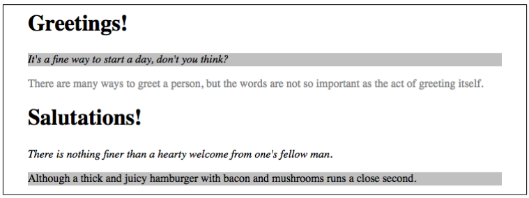
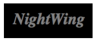
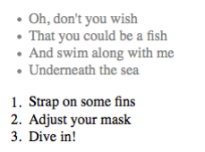
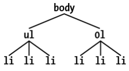
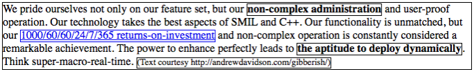
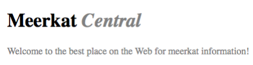
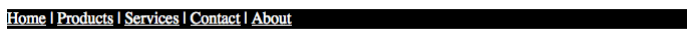
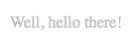

# 第 3 章 特异性和级联 Specificity and the Cascade

Chapter 2 showed how document structure and CSS selectors allow you to apply a wide variety of styles to elements. Knowing that every valid document generates a structural tree, you can create selectors that target elements based on their ancestors, attributes, sibling elements, and more. The structural tree is what allows selectors to function and is also central to a similarly crucial aspect of CSS: inheritance.

第 2 章介绍了文档结构和 CSS 选择器如何允许您将各种样式应用于元素。知道每个有效的文档都会生成一个结构树，您就可以创建选择器，根据它们的祖先、属性、兄弟元素等来定位元素。结构树允许选择器起作用，并且对于 CSS 的一个同样重要的方面:继承也很重要。

`Inheritance` is the mechanism by which some property values are passed on from an element to its descendants. When determining which values should apply to an element, a user agent must consider not only inheritance but also the `specificity` of the declarations, as well as the origin of the declarations themselves. This process of consideration is what’s known as the `cascade`. We will explore the interrelation between these three mechanisms—specificity, inheritance, and the cascade—in this chapter, but the difference between the latter two can be summed up this way: choosing the result of `h1 {color: red; color: blue;}` is the cascade; making a `span` inside the h1 blue is inheritance.

“继承”是将一些属性值从一个元素传递给它的后代的机制。在决定哪些值应该应用于元素时，用户代理不仅必须考虑继承，还必须考虑声明的“特殊性”，以及声明本身的来源。这种思考的过程被称为“级联”。在本章中，我们将探讨这三种机制——特异性、继承性和级联——之间的相互关系，但后两者之间的区别可以这样总结:选择“h1 {color: red;颜色:蓝色;}'是级联;在 h1 蓝色区域内创建“span”是继承。

Above all, regardless of how abstract things may seem, keep going! Your perseverance will be rewarded.

最重要的是，不管事情看起来多么抽象，都要坚持下去!你的坚持会得到回报的。

## 3.1 Specificity

You know from Chapter 2 that you can select elements using a wide variety of means. In fact, it’s possible that the same element could be selected by two or more rules, each with its own selector. Let’s consider the following three pairs of rules. Assume that each pair will match the same element:

从第 2 章可以知道，可以使用多种方法选择元素。实际上，相同的元素可以由两个或多个规则选择，每个规则都有自己的选择器。让我们考虑以下三对规则。假设每一对将匹配相同的元素:

```css
h1 {
  color: red;
}
body h1 {
  color: green;
}
h2.grape {
  color: purple;
}
h2 {
  color: silver;
}
html > body table tr[id='totals'] td ul > li {
  color: maroon;
}
li#answer {
  color: navy;
}
```

Only one of the two rules in each pair can win out, since the matched elements can be only one color or the other. How do we know which one will win?

因为匹配的元素只能是一种颜色，所以每对中只有一个规则可以胜出。我们怎么知道哪一个会赢?

The answer is found in the `specificity` of each selector. For every rule, the user agent evaluates the specificity of the selector and attaches it to each declaration in the rule.When an element has two or more conflicting property declarations, the one with the highest specificity will win out.

答案就在每个选择器的“特异性”中。对于每个规则，用户代理评估选择器的特异性，并将其附加到规则中的每个声明。当一个元素有两个或多个相互冲突的属性声明时，具有最高特异性的属性声明将胜出。

This isn’t the whole story in terms of conflict resolution. All style conflict resolution (including specificity) is handled by the cascade, which has its own section later in this chapter (“The Cascade” on page 106).

这并不是解决冲突的全部。所有风格冲突的解决(包括特性)都由 cascade 来处理，它在本章后面有自己的一节(“cascade”在 106 页)。

A selector’s specificity is determined by the components of the selector itself. A specificity value can be expressed in four parts, like this: `0,0,0,0`. The actual specificity of a selector is determined as follows:

选择器的特异性由选择器本身的组件决定。特异性值可以表达为四个部分，像这样:' 0,0,0,0 '。选择器的实际特异性确定如下:

- For every ID attribute value given in the selector, add `0,1,0,0`.
- For every class attribute value, attribute selection, or pseudo-class given in the selector, add `0,0,1,0`.
- For every element and pseudo-element given in the selector, add `0,0,0,1`. CSS2 contradicted itself as to whether pseudo-elements had any specificity at all, but CSS2.1 made it clear that they do, and this is where they belong.
- Combinators and the universal selector do not contribute anything to the specificity.

---

-对于选择器中给定的每个 ID 属性值，添加' 0,1,0,0 '。 -对于选择器中给出的每个类属性值、属性选择或伪类，添加' 0,0,1,0 '。 -对于选择器中给出的每个元素和伪元素，添加' 0,0,0,1 '。关于伪元素是否具有特异性，CSS2 自相矛盾，但 CSS2.1 明确表示它们具有特异性，这就是伪元素的归属。 -组合子和通用选择器对特异性没有任何贡献。

For example, the following rules’ selectors result in the indicated specificities:

例如，下列规则的选择器会导致指定的特性:

```css
h1 {
  color: red;
} /* specificity = 0,0,0,1 */
p em {
  color: purple;
} /* specificity = 0,0,0,2 */
.grape {
  color: purple;
} /* specificity = 0,0,1,0 */
*.bright {
  color: yellow;
} /* specificity = 0,0,1,0 */
p.bright em.dark {
  color: maroon;
} /* specificity = 0,0,2,2 */
#id216 {
  color: blue;
} /* specificity = 0,1,0,0 */
div#sidebar *[href] {
  color: silver;
} /* specificity = 0,1,1,1 */
```

Given a case where an `em` element is matched by both the second and fifth rules in this example, that element will be maroon because the fifth rule’s specificity outweighs the second’s.

在本例中，如果一个' em '元素同时与第二个和第五个规则匹配，则该元素将是褐红色的，因为第五个规则的特殊性超过第二个规则。

As an exercise, let’s return to the pairs of rules from earlier in the section and fill in the specificities:

作为练习，让我们回到本节前面的规则对，并填写具体内容:

```css
h1 {
  color: red;
} /* 0,0,0,1 */
body h1 {
  color: green;
} /* 0,0,0,2 (winner)*/
h2.grape {
  color: purple;
} /* 0,0,1,1 (winner) */
h2 {
  color: silver;
} /* 0,0,0,1 */
html > body table tr[id='totals'] td ul > li {
  color: maroon;
} /* 0,0,1,7 */
li#answer {
  color: navy;
} /* 0,1,0,1
 (winner) */
```

I’ve indicated the winning rule in each pair; in each case, it’s because the specificity is higher. Notice how they’re sorted. In the second pair, the selector h2.grape wins because it has an extra `1: 0,0,1,1` beats out `0,0,0,1`. In the third pair, the second rule wins because `0,1,0,1`wins out over `0,0,1,7`. In fact, the specificity value `0,0,1,0` will win out over the value `0,0,0,13`.

我已经指出了每一对的获胜规则;在每种情况下，这是因为特异性更高。注意它们是如何排序的。在第二对中，选择器 h2。葡萄赢了，因为它有一个额外的' 1,0,0,1,1 '击败了' 0,0,0,1 '。在第三对中，第二个规则胜出，因为' 0,1,0,1 '胜过' 0,0,1,7 '。事实上，特异性值‘0,0,1,0’将战胜‘0,0,0,13’。

This happens because the values are sorted from left to right. A specificity of `1,0,0,0` will win out over any specificity that begins with a `0`, no matter what the rest of the numbers might be. So `0,1,0,1` wins over `0,0,1,7` because the `1` in the first value’s second position beats out the `0` in the second value’s second position.

这是因为值是从左到右排序的。“1,0,0,0”的特异性胜过任何以“0”开头的特异性，不管其他数字是什么。所以' 0,1,0,1 '胜过' 0,0,1,7 '因为第一个值的第二个位置的' 1 '击败了第二个值的第二个位置的' 0 '。

### 3.1.1 Declarations and Specificity

Once the specificity of a selector has been determined, the specificity value will be conferred on all of its associated declarations. Consider this rule:

一旦选择器的特异性被确定，特异性值将被赋给它的所有相关声明。考虑这条规则:

```css
h1 {
  color: silver;
  background: black;
}
```

For specificity purposes, the user agent must treat the rule as if it were “ungrouped” into separate rules. Thus, the previous example would become:

出于特定的目的，用户代理必须将规则视为“未分组”为单独的规则。因此，前面的例子将变成:

```css
h1 {
  color: silver;
}
h1 {
  background: black;
}
```

Both have a specificity of `0,0,0,1`, and that’s the value conferred on each declaration. The same splitting-up process happens with a grouped selector as well. Given the rule:

两者都具有' 0,0,0,1 '的特异性，这是赋予每个声明的值。分组选择器也会发生相同的拆分过程。鉴于规则:

```css
h1,
h2.section {
  color: silver;
  background: black;
}
```

the user agent treats it if it were the following:

用户代理处理如下:

```css
h1 {
  color: silver;
} /* 0,0,0,1 */
h1 {
  background: black;
} /* 0,0,0,1 */
h2.section {
  color: silver;
} /* 0,0,1,1 */
h2.section {
  background: black;
} /* 0,0,1,1 */
```

This becomes important in situations where multiple rules match the same element and some of the declarations clash. For example, consider these rules:

这在多个规则匹配相同的元素和一些声明冲突的情况下变得非常重要。例如，考虑以下规则:

```css
h1 + p {
  color: black;
  font-style: italic;
} /* 0,0,0,2 */
p {
  color: gray;
  background: white;
  font-style: normal;
} /* 0,0,0,1 */
*.aside {
  color: black;
  background: silver;
} /* 0,0,1,0 */
```

When applied to the following markup, the content will be rendered as shown in Figure 3-1:

当应用于以下标记时，内容将呈现如图 3-1 所示:

```html
<h1>Greetings!</h1>
<p class="aside">
  It's a fine way to start a day, don't you think?
</p>
<p>
  There are many ways to greet a person, but the words are not as important as the act of greeting itself.
</p>
<h1>Salutations!</h1>
<p>
  There is nothing finer than a hearty welcome from one's fellow man.
</p>
<p class="aside">
  Although a thick and juicy hamburger with bacon and mushrooms runs a close second.
</p>
```

<div style="margin: 0 auto; width: 70%;">
  
</div>
<p align="center">图 3-1：How different rules affect a document</p>

In every case, the user agent determines which rules match a given element, calculates all of the associated declarations and their specificities, determines which rules win out, and then applies the winners to the element to get the styled result. These machinations must be performed on every element, selector, and declaration. Fortunately, the user agent does it all automatically. This behavior is an important component of the cascade, which we will discuss later in this chapter.

在每种情况下，用户代理确定哪些规则匹配给定的元素，计算所有关联的声明及其特殊性，确定哪些规则胜出，然后将胜出者应用于元素以获得样式化的结果。这些机制必须在每个元素、选择器和声明上执行。幸运的是，用户代理会自动完成这一切。这种行为是级联的一个重要组成部分，我们将在本章后面讨论。

### 3.1.2 Universal Selector Specificity

The universal selector does not contribute to specificity. In other words, it has a specificity of `0,0,0,0`, which is different than having no specificity (as we’ll discuss in “Inheritance” on page 103). Therefore, given the following two rules, a paragraph descended from a div will be black, but all other elements will be gray:

通用选择器不会增加特异性。换句话说，它具有' 0,0,0,0 '的特异性，这不同于没有特异性(正如我们将在 103 页的“继承”中讨论的那样)。因此，根据以下两条规则，从 div 派生的段落将是黑色的，但所有其他元素都是灰色的:

```css
div p {
  color: black;
} /* 0,0,0,2 */
* {
  color: gray;
} /* 0,0,0,0 */
```

As you might expect, this means the specificity of a selector that contains a universal selector along with other selectors is not changed by the presence of the universal selector. The following two selectors have exactly the same specificity:

正如您可能期望的那样，这意味着包含通用选择器和其他选择器的选择器的特殊性不会因为通用选择器的存在而改变。以下两个选择器具有完全相同的特异性:

```css
div p /* 0,0,0,2 */
body * strong /* 0,0,0,2 */
```

Combinators, by comparison, have no specificity at all—not even zero specificity. Thus, they have no impact on a selector’s overall specificity.

相比之下，组合子根本没有特异性——甚至没有特异性。因此，它们对选择器的总体特异性没有影响。

### 3.1.3 ID and Attribute Selector Specificity

It’s important to note the difference in specificity between an ID selector and an attribute selector that targets an `id` attribute. Returning to the third pair of rules in the example code, we find:

注意 ID 选择器和以' ID '属性为目标的属性选择器之间的区别非常重要。回到示例代码中的第三对规则，我们发现:

```css
html > body table tr[id='totals'] td ul > li {
  color: maroon;
} /* 0,0,1,7 */
li#answer {
  color: navy;
} /* 0,1,0,1 (wins) */
```

The ID selector (`#answer`) in the second rule contributes `0,1,0,0` to the overall specificity of the selector. In the first rule, however, the attribute selector (`[id="totals"]`) contributes `0,0,1,0` to the overall specificity. Thus, given the following rules, the element with an `id` of `meadow` will be green:

第二条规则中的 ID 选择器(' #answer ')将' 0,1,0,0 '贡献给选择器的总体特异性。然而，在第一个规则中，属性选择器(' [id="汇总"]')对总体特异性的贡献是' 0,0,1,0 '。因此，根据以下规则，id 为“meadow”的元素为绿色:

```css
#meadow {
  color: green;
} /* 0,1,0,0 */
*[id='meadow'] {
  color: red;
} /* 0,0,1,0 */
```

### 3.1.4 Inline Style Specificity

So far, we’ve only seen specificities that begin with a zero, so you may be wondering why it’s there at all. As it happens, that first zero is reserved for inline style declarations, which trump any other declaration’s specificity. Consider the following rule and markup fragment:

到目前为止，我们只看到以 0 开头的特殊情况，所以您可能想知道它为什么会出现。实际上，第一个零是为内联样式声明保留的，它胜过任何其他声明的特殊性。考虑以下规则和标记片段:

```css
h1 {
  color: red;
}
```

```html
<h1 style="color: green;">The Meadow Party</h1>
```

Given that the rule is applied to the `h1` element, you would still probably expect the text of the `h1` to be green. This happens because every inline declaration has a specificity of `1,0,0,0`.

假设规则应用于“h1”元素，您可能仍然期望“h1”的文本是绿色的。这是因为每个内联声明都有一个' 1,0,0,0 '的特异性。

This means that even elements with `id` attributes that match a rule will obey the inline style declaration. Let’s modify the previous example to include an `id`:

这意味着即使具有与规则匹配的' id '属性的元素也将遵循内联样式声明。让我们修改前面的例子，包括一个“id”:

```css
h1#meadow {
  color: red;
}
```

```html
<h1 id="meadow" style="color: green;">The Meadow Party</h1>
```

Thanks to the inline declaration’s specificity, the text of the `h1` element will still be green.

由于内联声明的特殊性，“h1”元素的文本仍然是绿色的。

### 3.1.5 Importance

Sometimes, a declaration is so important that it outweighs all other considerations. CSS calls these `important declarations` (for hopefully obvious reasons) and lets you mark them by inserting `!important` just before the terminating semicolon in a declaration:

有时候，一个声明是如此重要，以至于它超过了所有其他的考虑。CSS 调用这些“重要的声明”(希望原因显而易见)，并允许您通过插入“!”在声明中结束分号之前:

```css
p.dark {
  color: #333 !important;
  background: white;
}
```

Here, the color value of `#333` is marked `!important`, whereas the background value of `white` is not. If you wish to mark both declarations as important, each declaration needs its own `!important` marker:

在这里，' #333 '的颜色值被标记为' !“重要”，而“白色”的背景值不重要。如果您希望将两个声明都标记为重要的，那么每个声明都需要有自己的' !重要的标志:

```css
p.dark {
  color: #333 !important;
  background: white !important;
}
```

You must place `!important` correctly, or the declaration may be invalidated. `!important` always goes at the end of the declaration, just before the semicolon. This placement is especially important—no pun intended—when it comes to properties that allow values containing multiple keywords, such as `font`:

你必须放' !重要’，否则声明无效。”!重要的总是在声明的结尾，分号的前面。当涉及到允许包含多个关键字(如“font”)的值的属性时，这个位置尤其重要(没有双关语的意思):

```css
p.light {
  color: yellow;
  font: smaller Times, serif !important;
}
```

If `!important` were placed anywhere else in the `font` declaration, the entire declaration would likely be invalidated and none of its styles applied.

如果”!如果“important”被放置在“font”声明的其他位置，则整个声明可能会无效，并且其样式也不适用。

I realize that to those of you who come from a programming background, the syntax of this token instinctively translates to “not important.” For whatever reason, the bang (`!`) was chosen as the delimiter for important tokens, and it does `not` mean “not” in CSS, no matter how many other languages give it that very meaning. This association is unfortunate, but we’re stuck with it.

我意识到，对于那些有编程背景的人来说，这个标记的语法本能地解释为“不重要”。不管出于什么原因，bang(' ! ')被选为重要标记的分隔符，而它在 CSS 中并不是' not '的意思，不管有多少其他语言赋予它这种含义。这种联系是不幸的，但我们却深陷其中。

Declarations that are marked `!important` do not have a special specificity value, but are instead considered separately from non-important declarations. In effect, all `!important` declarations are grouped together, and specificity conflicts are resolved relatively within that group. Similarly, all non-important declarations are considered together, with any conflicts within the non-important group are resolved using specificity. Thus, in any case where an important and a non-important declaration conflict, the important declaration `always` wins.

标记为' !“重要”没有特殊的具体值，而是与不重要的声明分开考虑。实际上，所有的!重要的声明被分组在一起，而具体的冲突在该组内相对解决。类似地，所有不重要的声明都放在一起考虑，不重要的组中的任何冲突都使用特殊性来解决。因此，在重要的和不重要的声明冲突的任何情况下，重要的声明“总是”获胜。

Figure 3-2 illustrates the result of the following rules and markup fragment:

图 3-2 演示了以下规则和标记片段的结果:

```css
h1 {
  font-style: italic;
  color: gray !important;
}
.title {
  color: black;
  background: silver;
}
* {
  background: black !important;
}
```

```html
<h1 class="title">NightWing</h1>
```

<div style="margin: 0 auto; width: 70%;">
  
</div>
<p align="center">图 3-2：Important rules always win</p>

Important declarations and their handling are discussed in more detail in “The Cascade” on page 106.

重要的声明及其处理将在 106 页的“级联”中详细讨论。

## 3.2 Inheritance

As important as specificity may be to understanding how declarations are applied to a document, another key concept is `inheritance`. Inheritance is the mechanism by which some styles are applied not only to a specified element, but also to its descendants. If a color is applied to an `h1` element, for example, then that color is applied to all text inside the `h1`, even the text enclosed within child elements of that `h1`:

与特异性一样重要的是理解声明如何应用于文档，另一个关键概念是“继承”。继承是一种机制，通过这种机制，某些样式不仅应用于指定的元素，还应用于它的后代元素。例如，如果一个颜色应用于一个“h1”元素，那么这个颜色就应用于“h1”内的所有文本，即使是“h1”的子元素中包含的文本:

```css
h1 {
  color: gray;
}
```

```html
<h1>Meerkat <em>Central</em></h1>
```

Both the ordinary `h1` text and the `em` text are colored gray because the `em` element inherits the value of `color` from the `h1`. If property values could not be inherited by descendant elements, the `em` text would be black, not gray, and we’d have to color the elements separately.

普通的“h1”文本和“em”文本都是灰色的，因为“em”元素从“h1”继承了“color”的值。如果属性值不能被后代元素继承，' em '文本将是黑色的，而不是灰色的，我们将不得不分别为元素上色。

Consider an unordered list. Let’s say we apply a style of `color: gray;` for `ul` elements:

考虑一个无序列表。假设我们对“ul”元素应用“color: gray”样式:

```css
ul {
  color: gray;
}
```

We expect that style applied to a `ul` will also be applied to its list items, and also to any content of those list items. Thanks to inheritance, that’s exactly what happens, as Figure 3-3 demonstrates.

我们期望应用于“ul”的样式也将应用于它的列表项，以及那些列表项的任何内容。多亏了继承，这正是所发生的，如图 3-3 所示。

<div style="margin: 0 auto; width: 70%;">
  
</div>
<p align="center">图 3-3：Inheritance of styles</p>

It’s easier to see how inheritance works by turning to a tree diagram of a document. Figure 3-4 shows the tree diagram for a very simple document containing two lists: one unordered and the other ordered.

通过查看文档的树形图，很容易看出继承是如何工作的。图 3-4 显示了一个非常简单的文档的树形图，其中包含两个列表:一个是无序的，另一个是有序的。

<div style="margin: 0 auto; width: 70%;">
  
</div>
<p align="center">图 3-4：A simple tree diagram</p>

When the declaration `color: gray;` is applied to the `ul` element, that element takes on that declaration. The value is then propagated down the tree to the descendant elements and continues on until there are no more descendants to inherit the value. Values are `never` propagated upward; that is, an element never passes values up to its ancestors.

当将声明“color: gray;”应用于“ul”元素时，该元素接受该声明。然后，该值向下传播到树的后代元素，并继续下去，直到没有更多的后代继承该值。值“从不”向上传播;也就是说，元素从不将值传递给它的祖先。

There is an exception to the upward propagation rule in HTML: background styles applied to the `body` element can be passed to the `html` element, which is the document’s root element and therefore defines its canvas. This only happens if the `body` element has a defined background and the html element does not.

HTML 中的向上传播规则有一个例外:应用于“body”元素的背景样式可以传递给“HTML”元素，后者是文档的根元素，因此定义了它的画布。只有当“body”元素有一个定义好的背景，而 html 元素没有时，才会发生这种情况。

Inheritance is one of those things about CSS that is so basic that you almost never think about it unless you have to. However, you should still keep a couple of things in mind.

继承是 CSS 的基本特性之一，除非迫不得已，否则你几乎不会考虑它。然而，你仍然应该记住一些事情。

First, note that many properties are not inherited—generally in order to avoid undesirable outcomes. For example, the property `border` (which is used to set borders on elements) does not inherit. A quick glance at Figure 3-5 reveals why this is the case. If borders were inherited, documents would become much more cluttered—unless the author took the extra effort to turn off the inherited borders.

首先，注意许多属性没有被继承——通常是为了避免不希望的结果。例如，属性“border”(用于设置元素的边框)不会继承。快速浏览一下图 3-5 就会发现为什么会这样。如果边界是继承的，文档就会变得更加混乱——除非作者付出额外的努力来关闭继承的边界。

<div style="margin: 0 auto; width: 70%;">
  
</div>
<p align="center">图 3-5：Why borders aren’t inherited</p>

As it happens, most of the box-model properties—including margins, padding, backgrounds, and borders—are not inherited for the same reason. After all, you likely wouldn’t want all of the links in a paragraph to inherit a 30-pixel left margin from their parent element!

凑巧的是，大多数 box-model 属性——包括边距、填充、背景和边界——都不是出于相同的原因继承的。毕竟，您可能不希望段落中的所有链接都继承父元素的 30 像素左距!

Second, inherited values have no specificity at all, not even zero specificity. This seems like an academic distinction until you work through the consequences of the lack of inherited specificity. Consider the following rules and markup fragment and compare them to the result shown in Figure 3-6:

其次，遗传值完全没有特异性，甚至没有特异性。这似乎是一个学术上的区别，直到你解决了缺乏遗传特异性的后果。考虑以下规则和标记片段，并将它们与图 3-6 所示的结果进行比较:

```css
* {
  color: gray;
}
h1#page-title {
  color: black;
}
```

```html
<h1 id="page-title">Meerkat <em>Central</em></h1>
<p>
  Welcome to the best place on the web for meerkat information!
</p>
```

<div style="margin: 0 auto; width: 70%;">
  
</div>
<p align="center">图 3-6：Zero specificity defeats no specificity</p>

Since the universal selector applies to all elements and has zero specificity, its color declaration’s value of `gray` wins out over the inherited value of `black`, which has no specificity at all. Therefore, the `em` element is rendered gray instead of black.

由于通用选择器适用于所有元素，并且没有任何特异性，所以它的颜色声明的值“gray”胜过了继承的值“black”，后者没有任何特异性。因此，' em '元素呈现为灰色而不是黑色。

This example vividly illustrates one of the potential problems of using the universal selector indiscriminately. Because it can match `any` element, the universal selector often has the effect of short-circuiting inheritance. This can be worked around, but it’s usually more sensible to avoid the problem in the first place by not using the universal selector indiscriminately.

这个例子生动地说明了不加选择地使用通用选择器的一个潜在问题。因为它可以匹配“任何”元素，所以通用选择器通常具有短路继承的效果。这是可以解决的，但通常更明智的做法是首先通过不随意使用通用选择器来避免这个问题。

The complete lack of specificity for inherited values is not a trivial point. For example, assume that a style sheet has been written such that all text in a “toolbar” is to be white on black:

继承值完全缺乏特异性并不是一个微不足道的问题。例如，假设一个样式表被编写成“工具栏”中的所有文本都是黑白的:

```css
#toolbar {
  color: white;
  background: black;
}
```

This will work so long as the element with an `id` of `toolbar` contains nothing but plain text. If, however, the text within this element is all hyperlinks (`a` elements), then the user agent’s styles for hyperlinks will take over. In a web browser, this means they’ll likely be colored blue, since the browser’s internal style sheet probably contains an entry like this:

只要带有“工具栏”的“id”的元素只包含纯文本，此方法就有效。但是，如果此元素中的文本是所有超链接(' a '元素)，则用户代理的超链接样式将接管。在 web 浏览器中，这意味着它们可能是蓝色的，因为浏览器的内部样式表可能包含这样的条目:

```css
a:link {
  color: blue;
}
```

To overcome this problem, you must declare something like this:

要解决这个问题，您必须声明如下内容:

```css
#toolbar {
  color: white;
  background: black;
}
#toolbar a:link {
  color: white;
}
```

By targeting a rule directly at the `a` elements within the toolbar, you’ll get the result shown in Figure 3-7.

通过将规则直接指向工具栏中的“a”元素，您将得到如图 3-7 所示的结果。

<div style="margin: 0 auto; width: 70%;">
  
</div>
<p align="center">图 3-7：Directly assigning styles to the relevant elements</p>

Another way to get the same result is to use the value `inherit`, covered in the previous chapter. We can alter the previous example like so:

获得相同结果的另一种方法是使用前一章介绍的值“inherit”。我们可以这样改变前面的例子:

```css
#toolbar {
  color: white;
  background: black;
}
#toolbar a:link {
  color: inherit;
}
```

This also leads to the result shown in Figure 3-7, because the value of `color` is explicitly inherited thanks to an assigned rule whose selector has specificity.

这也导致了图 3-7 所示的结果，因为“color”的值是显式继承的，这要归功于一个指定的规则，其选择器具有特殊性。

## 3.3 The Cascade

Throughout this chapter, we’ve skirted one rather important issue: what happens when two rules of equal specificity apply to the same element? How does the browser resolve the conflict? For example, consider the following rules:

在这一章中，我们回避了一个非常重要的问题:当两个同样特殊的规则应用于相同的元素时会发生什么?浏览器如何解决冲突?例如，考虑以下规则:

```css
h1 {
  color: red;
}
h1 {
  color: blue;
}
```

Which one wins? Both have a specificity of `0,0,0,1`, so they have equal weight and should both apply. That can’t be the case because the element can’t be both red and blue. So which will it be?

哪一个赢了?两者的特异性都是' 0,0,0,1 '，所以它们的权重相等，应该都适用。这不可能，因为元素不能同时是红色和蓝色的。那么会是哪一个呢?

At last, the name “Cascading Style Sheets” makes sense: CSS is based on a method of causing styles to `cascade` together, which is made possible by combining inheritance and specificity with a few rules. The cascade rules for CSS are:

最后，“层叠样式表”这个名称是有意义的:CSS 是基于一种使样式“层叠”在一起的方法，这是通过将继承和特定与一些规则相结合而实现的。CSS 的级联规则是:

1. Find all rules that contain a selector that matches a given element.
2. Sort all declarations applying to the given element by explicit weight. Those rules marked `!important` have a higher weight than those that are not.
3. Sort all declarations applying to the given element by origin. There are three basic origins: author, reader, and user agent. Under normal circumstances, the author’s styles win out over the reader’s styles. `!important` reader styles are stronger than any other styles, including `!important` author styles. Both author and reader styles override the user agent’s default styles.
4. Sort all declarations applying to the given element by `specificity`. Those elements with a higher specificity have more weight than those with lower specificity.
5. Sort all declarations applying to the given element by `order`. The later a declaration appears in the style sheet or document, the more weight it is given. Declarations that appear in an imported style sheet are considered to come before all declarations within the style sheet that imports them.

---

1. 查找包含与给定元素匹配的选择器的所有规则。
2. 按显式权重对应用于给定元素的所有声明排序。那些规则写着‘!重要的比不重要的更重要。
3. 按来源对应用于给定元素的所有声明进行排序。有三个基本的来源:作者、读者和用户代理。通常情况下，作者的风格胜过读者的风格。”!重要的“读者风格比任何其他风格都强，包括”!重要的作者风格。author 和 reader 样式都会覆盖用户代理的默认样式。
4. 根据“特异性”对应用于给定元素的所有声明进行排序。特异性高的元素比特异性低的元素具有更高的权重。
5. 将应用于给定元素的所有声明按“order”排序。声明在样式表或文档中出现得越晚，它的权重就越大。出现在导入的样式表中的声明被认为位于导入它们的样式表中的所有声明之前。

To be perfectly clear about how this all works, let’s consider some examples that illustrate the last four of the five cascade rules.

为了更清楚地了解这一切是如何工作的，让我们考虑一些示例，这些示例演示了 5 个级联规则中的最后 4 个。

Some later CSS modules add more origins to the basic list of three; for example, the animation and transition origins. These are not covered here, but are addressed in the chapters on those topics.

一些后来的 CSS 模块添加了更多的起源到基本列表三个;例如，动画和过渡的起源。这里不涉及这些内容，但是在关于这些主题的章节中会提到。

### 3.3.1 Sorting by Weight and Origin

If two rules apply to an element, and one is marked `!important`, the important rule wins out:

如果两个规则应用于一个元素，其中一个被标记为' !重要的规则胜出:

```css
p {
  color: gray !important;
}
```

```html
<p style="color: black;">Well, <em>hello</em> there!</p>
```

Despite the fact that there is a color assigned in the `style` attribute of the paragraph, the `!important` rule wins out, and the paragraph is gray. This gray is inherited by the `em` element as well.

尽管在段落的' style '属性中分配了一个颜色，' !重要规则胜出，段落是灰色的。这个灰色也由' em '元素继承。

Note that if an `!important` is added to the inline style, then `it` will be the winner. Thus, given the following, the paragraph (and its descendant element) will be black:

注意，如果一个' !“重要”被添加到内联样式中，那么“它”将成为赢家。因此，在下面的情况下，该段(及其后代元素)将是黑色的:

```css
p {
  color: gray !important;
}
```

```html
<p style="color: black !important;">Well, <em>hello</em> there!</p>
```

In situations where the explicit weight is the same, the origin of a rule is considered. If an element is matched by normal-weight styles in both the author’s style sheet and the reader’s style sheet, then the author’s styles are used. For example, assume that the following styles come from the indicated origins:

在显式权值相同的情况下，将考虑规则的起源。如果一个元素在作者的样式表和读者的样式表中都匹配了正常权重的样式，那么就使用作者的样式。例如，假设以下样式来自指定的起源:

```css
p em {
  color: black;
} /* author's style sheet */
p em {
  color: yellow;
} /* reader's style sheet */
```

In this case, emphasized text within paragraphs is colored black, not yellow, because normal-weight author styles win out over normal-weight reader styles. However, if both rules are marked `!important`, the situation changes:

在这种情况下，段落中强调的文本是黑色的，而不是黄色的，因为正常重量的作者风格胜过正常重量的读者风格。然而，如果两个规则都标记了' !重要的是，情况发生了变化:

```css
p em {
  color: black !important;
} /* author's style sheet */
p em {
  color: yellow !important;
} /* reader's style sheet */
```

Now the emphasized text in paragraphs will be yellow, not black.

现在段落中强调的文本将是黄色的，而不是黑色的。

As it happens, the user agent’s default styles—which are often influenced by the user preferences—are figured into this step. The default style declarations are the least influential of all. Therefore, if an author-defined rule applies to anchors (e.g., declaring them to be `white`), then this rule overrides the user agent’s defaults.

在此过程中，用户代理的默认样式(通常受用户偏好的影响)将被考虑到此步骤中。默认样式声明的影响是最小的。因此，如果作者定义的规则适用于锚(例如，声明它们为“白色”)，那么该规则将覆盖用户代理的默认值。

To sum up, there are five basic levels to consider in terms of declaration weight. In order of most to least weight, these are:

综上所述，在申报权重方面，有五个基本层次需要考虑。按重量从大到小依次为:

1. Reader important declarations
2. Author important declarations
3. Author normal declarations
4. Reader normal declarations
5. User agent declarations

---

1. 读者重要声明
2. 作者重要声明
3. 正常的作者声明
4. 读者正常的声明
5. 用户代理声明

Authors typically need to worry about only the first four weight levels, since anything declared by an author will win out over the user agent’s styles.

作者通常只需要担心前四个权重级别，因为作者声明的任何内容都会胜过用户代理的样式。

### 3.3.2 Sorting by Specificity

If conflicting declarations apply to an element and they all have the same explicit weight and origin, they should be sorted by specificity, with the most specific declaration winning out, like this:

如果相互冲突的声明适用于某个元素，并且它们都具有相同的显式权重和来源，则应该根据特异性对它们进行排序，最具体的声明胜出，如下所示:

```css
p#bright {
  color: silver;
}
p {
  color: black;
}
```

```html
<p id="bright">Well, hello there!</p>
```

Given the rules shown, the text of the paragraph will be silver, as illustrated in Figure 3-8. Why? Because the specificity of `p#bright (0,1,0,1)` overrode the specificity of `p (0,0,0,1)`, even though the latter rule comes later in the style sheet.

根据所示的规则，段落的文本将是银色的，如图 3-8 所示。为什么?因为“p#bright(0,1,0,1)”的特殊性覆盖了“p(0,0,0,1)”的特殊性，即使后者的规则在样式表中稍后出现。

<div style="margin: 0 auto; width: 70%;">
  
</div>
<p align="center">图 3-8：Higher specificity wins out over lower specificity</p>

### 3.3.3 Sorting by Order

Finally, if two rules have exactly the same explicit weight, origin, and specificity, then the one that occurs later in the style sheet wins out. Let’s return to our earlier example, where we find the following two rules in the document’s style sheet:

最后，如果两个规则具有完全相同的显式权重、来源和特性，则样式表中稍后出现的规则胜出。让我们回到前面的例子，我们在文档的样式表中发现了以下两个规则:

```css
h1 {
  color: red;
}
h1 {
  color: blue;
}
```

In this case, the value of `color` for all `h1` elements in the document will be `blue`, not `red`. This is because the two rules are tied with each other in terms of explicit weight and origin, and the selectors have equal specificity, so the last one declared is the winner.

在本例中，文档中所有“h1”元素的“color”值将为“blue”，而不是“red”。这是因为这两个规则在显式权重和来源方面是相互关联的，并且选择器具有相同的特异性，所以最后一个声明的规则是赢家。

So what happens if rules from completely separate style sheets conflict? For example, suppose the following:

那么，如果来自完全不同的样式表的规则发生冲突，会发生什么情况呢?例如，假设如下:

```css
@import url(basic.css);
h1 {
  color: blue;
}
```

What if `h1 {color: red;}` appears in `basic.css`? The entire contents of `basic.css` are treated as if they were pasted into the style sheet at the point where the @import occurs. Thus, any rule contained in the document’s style sheet occurs later than those from the `@import`. If they tie in terms of explicit weight and specificity, the document’s style sheet contains the winner. Consider the following:

如果“h1 {color: red;}”出现在“basic.css”中会怎样?基本的全部内容。css '被视为在@import 发生的地方被粘贴到样式表中。因此，文档样式表中包含的任何规则出现的时间都晚于“@import”中的规则。如果它们在显式的权重和特异性方面相匹配，则文档的样式表将包含获胜者。考虑以下:

```css
p em {
  color: purple;
} /* from imported style sheet */
p em {
  color: gray;
} /* rule contained within the document */
```

In this case, the second rule shown wins out over the imported rule because it was the last one specified.

在本例中，显示的第二个规则胜过导入的规则，因为它是最后一个指定的规则。

Order sorting is the reason behind the often-recommended ordering of link styles. The recommendation is that you array your link styles in the order link-visited-focushover-active, or LVFHA, like this:

排序是经常推荐的链接样式排序背后的原因。建议您按照链接访问-focushover-active 或 LVFHA 的顺序排列链接样式，如下所示:

```css
a:link {
  color: blue;
}
a:visited {
  color: purple;
}
a:focus {
  color: green;
}
a:hover {
  color: red;
}
a:active {
  color: orange;
}
```

Thanks to the information in this chapter, you now know that the specificity of all of these selectors is the same: `0,0,1,0`. Because they all have the same explicit weight, origin, and specificity, the last one that matches an element will win out. An unvisited link that is being “clicked” or otherwise activated, such as via the keyboard, is matched by four of the rules—`:link`, `Lfocus`, `:hover`, and `:active`—so the last one of those four will win out. Given the LVFHA ordering, `:active` will win, which is likely what the author intended.

由于本章中的信息，您现在知道所有这些选择器的特性都是相同的:' 0,0,1,0 '。因为它们都具有相同的显式权重、来源和特异性，所以最后一个匹配元素的元素将胜出。正在被“点击”或通过键盘等方式激活的未访问链接，由“:链接”、“Lfocus”、“:hover”和“:active”这四个规则匹配，因此这四个规则中的最后一个将胜出。考虑到 LVFHA 的顺序，“:active”将胜出，这可能是作者的本意。

Assume for a moment that you decide to ignore the common ordering and alphabetize your link styles instead. This would yield:

假设您暂时决定忽略常见的顺序，而是按字母顺序排列链接样式。这将产生:

```css
a:active {
  color: orange;
}
a:focus {
  color: green;
}
a:hover {
  color: red;
}
a:link {
  color: blue;
}
a:visited {
  color: purple;
}
```

Given this ordering, no link would ever show `:hover`, `:focus`, or `:active` styles because the `:link` and `:visited` rules come after the other three. Every link must be either visited or unvisited, so those styles will always override the others.

按照这种顺序，没有一个链接会显示“:hover”、“:focus”或“:active”样式，因为“:link”和“:visited”规则位于其他三个样式之后。每个链接都必须访问或未访问，因此这些样式总是覆盖其他样式。

Let’s consider a variation on the LVFHA order that an author might want to use. In this ordering, only unvisited links will get a hover style; visited links do not. Both visited and unvisited links will get an active style:

让我们考虑一下作者可能希望使用的 LVFHA 顺序的变体。在这个顺序，只有未访问的链接将得到一个悬停样式;访问过的链接没有。已访问和未访问的链接将得到一个积极的风格:

```css
a:link {
  color: blue;
}
a:hover {
  color: red;
}
a:visited {
  color: purple;
}
a:focus {
  color: green;
}
a:active {
  color: orange;
}
```

Such conflicts arise only when all the states attempt to set the same property. If each state’s styles address a different property, then the order does not matter. In the following case, the link styles could be given in any order and would still function as intended:

只有当所有国家都试图设置相同的财产时，才会出现这种冲突。如果每个状态的样式处理不同的属性，则顺序无关紧要。在以下情况下，链接样式可以以任何顺序给出，并且仍然可以正常工作:

```css
a:link {
  font-weight: bold;
}
a:visited {
  font-style: italic;
}
a:focus {
  color: green;
}
a:hover {
  color: red;
}
a:active {
  background: yellow;
}
```

You may also have realized that the order of the `:link` and `:visited` styles doesn’t matter. You could order the styles LVFHA or VLFHA with no ill effect.

您可能也已经意识到':link '和':visited '样式的顺序并不重要。你可以订购风格 LVFHA 或 VLFHA 没有不良影响。

The ability to chain pseudo-classes together eliminates all these worries. The following could be listed in any order without any overrides:

将伪类链接在一起的能力消除了所有这些担忧。以下可以按任意顺序列出，不存在任何覆盖:

```css
a:link {
  color: blue;
}
a:visited {
  color: purple;
}
a:link:hover {
  color: red;
}
a:visited:hover {
  color: gray;
}
```

Because each rule applies to a unique set of link states, they do not conflict. Therefore, changing their order will not change the styling of the document. The last two rules do have the same specificity, but that doesn’t matter. A hovered unvisited link will not be matched by the rule regarding hovered visited links, and vice versa. If we were to add active-state styles, then order would start to matter again. Consider:

因为每个规则都适用于一组惟一的链接状态，所以它们并不冲突。因此，更改它们的顺序不会改变文档的样式。最后两条规则确实具有相同的特殊性，但这并不重要。未访问的已悬停链接将不匹配有关已悬停已访问链接的规则，反之亦然。如果我们要添加活动状态样式，那么顺序将再次开始起作用。考虑:

```css
a:link {
  color: blue;
}
a:visited {
  color: purple;
}
a:link:hover {
  color: red;
}
a:visited:hover {
  color: gray;
}
a:link:active {
  color: orange;
}
a:visited:active {
  color: silver;
}
```

If the active styles were moved before the hover styles, they would be ignored. Again, this would happen due to specificity conflicts. The conflicts could be avoided by adding more pseudo-classes to the chains, like this:

如果活动样式在悬停样式之前移动，它们将被忽略。同样，这也会由于特殊性冲突而发生。可以通过向链中添加更多的伪类来避免冲突，如下所示:

```css
a:link:hover:active {
  color: orange;
}
a:visited:hover:active {
  color: silver;
}
```

This does have the effect of raising the specificity of the selectors—both have a specificity value of `0,0,3,1`—but they don’t conflict because the actual selection states are mutually exclusive. A link can’t be an unvisited hovered active link `and` an unvisited hovered active link: only one of the two rules will match, and the styles applied accordingly.

这确实有提高选择器的特异性的效果—两者的特异性值都是' 0,0,3,1 '—但是它们并不冲突，因为实际的选择状态是相互排斥的。链接不能被一个,并且在积极联系”和“一个盘旋,并且积极链接:只有一个两个规则的匹配,并相应的样式应用。

### 3.3.4 Non-CSS Presentational Hints

It is possible that a document will contain presentational hints that are not CSS—for example, the `font` element. Such presentational hints are treated as if they have a specificity of `0` and appear at the `beginning` of the author’s stylesheet. Such presentation hints will be overridden by any author or reader styles, but not by the user agent’s styles. In CSS3, presentational hints from outside CSS are treated as if they belong to the user agent’s stylesheet, presumably at the end (although as of this writing, the specification doesn’t say).

文档可能包含非 css 的表示提示—例如，“font”元素。这样的表示提示被视为具有“0”的特殊性，并出现在作者样式表的“开始”处。这种表示提示将被任何作者或读者样式覆盖，但不会被用户代理的样式覆盖。在 CSS3 中，来自 CSS 外部的表示提示被视为属于用户代理的样式表，可能是在最后(尽管在撰写本文时，规范没有说明)。

## 3.4 Summary

Perhaps the most fundamental aspect of Cascading Style Sheets is the cascade itself—the process by which conflicting declarations are sorted out and from which the final document presentation is determined. Integral to this process is the specificity of selectors and their associated declarations, and the mechanism of inheritance.

级联样式表最基本的方面可能是级联本身，这是一个处理相互冲突的声明并确定最终文档表示的过程。这个过程中不可或缺的是选择器及其相关声明的特殊性，以及继承机制。
