# 第 7 章 基本的视觉格式化 Basic Visual Formatting

This chapter is all about the theoretical side of visual rendering in CSS. Why is that necessary? The answer is that with a model as open and powerful as that contained within CSS, no book could hope to cover every possible way of combining properties and effects. You will undoubtedly go on to discover new ways of using CSS. In exploring CSS, you may encounter seemingly strange behaviors in user agents. With a thorough grasp of how the visual rendering model works, you’ll be better able to determine whether a behavior is a correct (if unexpected) consequence of the rendering engine CSS defines.

本章是关于 CSS 中可视化渲染的理论部分。为什么有这个必要?答案是，有了像 CSS 中所包含的那样开放和强大的模型，没有一本书能够涵盖所有可能的组合属性和效果的方法。毫无疑问，您将继续探索使用 CSS 的新方法。在研究 CSS 时，您可能会在用户代理中遇到一些看似奇怪的行为。通过对可视化呈现模型如何工作的深入了解，您将能够更好地确定一个行为是否是呈现引擎 CSS 定义的正确(如果未预料到)结果。

## 7.1 Basic Boxes

At its core, CSS assumes that every element generates one or more rectangular boxes, called element boxes. (Future versions of the specification may allow for nonrectangular boxes, and indeed there have been proposals to change this, but for now everything is rectangular.) Each element box has a `content area` at its center. This content area is surrounded by optional amounts of padding, borders, outlines, and margins. These areas are considered optional because they could all be set to a width of zero, effectively removing them from the element box. An example content area is shown in Figure 7-1, along with the surrounding regions of padding, borders, and margins.

在其核心，CSS 假设每个元素生成一个或多个矩形框，称为元素框。(规范的未来版本可能允许使用非矩形框，确实有人建议对此进行更改，但目前所有内容都是矩形的。)每个元素框的中心都有一个内容区域。这个内容区域被可选的填充、边框、轮廓和边距包围。这些区域被认为是可选的，因为它们都可以设置为宽度为 0，从而有效地将它们从元素框中移除。图 7-1 显示了一个示例内容区域，以及周围的填充、边框和边距区域。

Each of the margins, borders, and the padding can be set using various side-specific properties, such as `margin-left` or `border-bottom`, as well as shorthand properties such as `padding`. The outline, if any, does not have side-specific properties. The content’s background—a color or tiled image, for example—is applied within the padding by default. The margins are always transparent, allowing the background(s) of any parent element(s) to be visible. Padding cannot have a negative length, but margins can. We’ll explore the effects of negative margins later on.

每个边距、边框和内边距都可以使用各种特定于边的属性进行设置，如左边框或边框-底部，以及内边距等简写属性。大纲(如果有的话)没有特定于边的属性。内容的背景(例如，颜色或平铺图像)默认应用于填充内。页边距总是透明的，允许任何父元素的背景都是可见的。填充不能有负长度，但是空白可以。稍后我们将探讨负边距的影响。

<div style="margin: 0 auto; width: 70%;">
  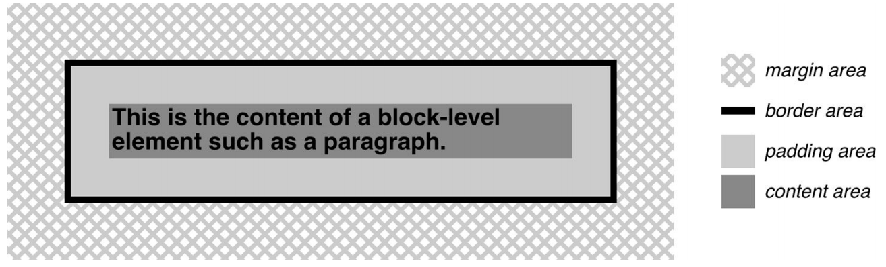
</div>
<p align="center">图 7-1：The content area and its surroundings</p>

Borders are generated using defined styles, such as `solid` or `inset`, and their colors are set using the `border-color` property. If no color is set, then the border takes on the foreground color of the element’s content. For example, if the text of a paragraph is white, then any borders around that paragraph will be white, `unless` the author explicitly declares a different border color. If a border style has gaps of some type, then the element’s background is visible through those gaps by default. Finally, the width of a border can never be negative.

边框是使用已定义的样式生成的，如实体或 inset，它们的颜色是使用 border-color 属性设置的。如果没有设置颜色，则边框采用元素内容的前景色。例如，如果一个段落的文本是白色的，那么该段落周围的任何边框都是白色的，除非作者明确声明了不同的边框颜色。如果边框样式有某种类型的空白，则默认情况下元素的背景可以通过这些空白显示。最后，边框的宽度不能为负。

The various components of an element box can be affected via a number of proper‐ ties, such as `width` or `border-right`. Many of these properties will be used in this book, even though they aren’t defined here.

一个元件盒的各个部件可以通过一些合适的参数受到影响，如宽度或边界右侧。这些属性中有许多将在本书中使用，尽管它们在这里没有定义。

### 7.1.1 A Quick Refresher

Let’s quickly review the kinds of boxes we’ll be discussing, as well as some important terms that are needed to follow the explanations to come:

让我们快速回顾一下我们将要讨论的方框的类型，以及接下来的解释中需要用到的一些重要术语:

`Normal flow`

This is the left-to-right, top-to-bottom rendering of text in Western languages and the familiar text layout of traditional HTML documents. Note that the flow direction may be changed in non-Western languages. Most elements are in the normal flow, and the only way for an element to leave the normal flow is to be floated, positioned, or made into a flexible box or grid layout element. Remember, the discussions in this chapter cover only elements in the normal flow.

这是西方语言中从左到右、从上到下的文本呈现，是传统 HTML 文档中常见的文本布局。注意，在非西方语言中，流的方向可能会改变。大多数元素都在常规流中，元素离开常规流的惟一方法是浮动、定位或做成一个灵活的盒子或网格布局元素。请记住，本章的讨论只涉及正常流程中的元素。

`Nonreplaced element`

This is an element whose content is contained within the document. For example, a paragraph (`p`) is a nonreplaced element because its textual content is found within the element itself.

这个元素的内容包含在文档中。例如，段落(p)是不可替换的元素，因为它的文本内容是在元素本身中找到的。

`Replaced element`

This is an element that serves as a placeholder for something else. The classic example of a replaced element is the `img` element, which simply points to an image file that is inserted into the document’s flow at the point where the `img` element itself is found. Most form elements are also replaced (e.g., `<input type="radio">`).

这是一个元素，用作其他内容的占位符。被替换元素的典型示例是 img 元素，它简单地指向一个图像文件，该文件被插入到文档流中找到 img 元素本身的地方。大多数表单元素也被替换（例如 `<input type="radio">`）

`Root element`

This is the element at the top of the document tree. In HTML documents, this is the element `html`. In XML documents, it can be whatever the language permits; for example, the root element of RSS files is `rss`.

这是文档树顶部的元素。在 HTML 文档中，这是元素 HTML。在 XML 文档中，它可以是语言允许的任何内容;例如，RSS 文件的根元素是 RSS。

`Block box`

This is a box that an element such as a paragraph, heading, or `div` generates. These boxes generate “new lines” both before and after their boxes when in the normal flow so that block boxes in the normal flow stack vertically, one after another. Any element can be made to generate a block box by declaring `display: block`.

这是一个由段落、标题或 div 等元素生成的框。在正常流中，这些框会在它们的框之前和之后生成“新行”，以便垂直地一个接一个地阻塞正常流堆栈中的框。任何元素都可以通过声明 `display: block` 来生成一个块框。

`Inline box`

This is a box that an element such as `strong` or `span` generates. These boxes do not generate “line breaks” before or after themselves. Any element can be made to generate an inline box by declaring `display: inline`.

这是一个由诸如 strong 或 span 之类的元素生成的方框。这些框不会在它们自己之前或之后生成“换行符”。任何元素都可以通过声明 `display: inline` 来生成内联框。

`Inline-block box`

This is a box that is like a block box internally, but acts like an inline box externally. It acts similar to, but not quite the same as, a replaced element. Imagine picking up a `div` and sticking it into a line of text as if it were an inline image, and you’ve got the idea.

这是一个内部类似于块盒，但在外部充当内联盒的盒子。它的作用与被替换的元素类似，但又不完全相同。想象一下，拿起一个 div，把它插入到一行文本中，就好像它是一个内联图像一样，你就明白了。

There are several other types of boxes, such as table-cell boxes, but they won’t be covered in this book for a variety of reasons—not the least of which is that their complexity demands a book of its own, and very few authors will actually wrestle with them on a regular basis.

有几种其他类型的盒子,例如表格单元框,但他们不会为各种各样的理由不覆盖在这本书中最小的就是它们的复杂性要求自己的一本书,和很少有作者会定期与他们搏斗。

### 7.1.2 The Containing Block

There is one more kind of box that we need to examine in detail, and in this case enough detail that it merits its own section: the containing block.

还有一种类型的 box 需要我们详细地研究，在这种情况下，它有足够的细节值得自己的部分:包含块。

Every element’s box is laid out with respect to its containing block; in a very real way, the containing block is the “layout context” for a box. CSS defines a series of rules for determining a box’s containing block. We’ll cover only those rules that pertain to the concepts covered in this book in order to keep our focus.

每个元素的盒相对于其包含块进行布局;以一种非常真实的方式，包含块是一个框的“布局上下文”。CSS 定义了一系列规则来确定一个框的包含块。我们将只讨论那些与本书所涵盖的概念相关的规则，以保持我们的重点。

For an element in the normal, Western-style flow of text, the containing block forms from the content edge of the nearest ancestor that generated a list item or block box which includes all table-related boxes (e.g., those generated by table cells). Consider the following markup:

对于正常的西式文本流中的元素，包含的块形成于最近的祖先的内容边缘，它生成一个列表项或块框，其中包括所有与表相关的框(例如，由表单元格生成的框)。考虑以下标记:

```html
<body>
  <div>
    <p>This is a paragraph.</p>
  </div>
</body>
```

In this very simple markup, the containing block for the `p` element’s block box is the `div` element’s block box, as that is the closest ancestor element box that is a block or a list item (in this case, it’s a block box). Similarly, the `div`’s containing block is the body’s box. Thus, the layout of the `p` is dependent on the layout of the `div`, which is in turn dependent on the layout of the body element.

在这个非常简单的标记中，p 元素的块框的包含块是 div 元素的块框，因为它是块或列表项最接近的祖先元素框(在本例中，它是块框)。类似地，div 的包含块是主体的框。因此，p 的布局依赖于 div 的布局，而 div 又依赖于 body 元素的布局。

And above that, the layout of the `body` element is dependent on the layout of the `html` element, whose box creates what is called the `initial containing block`. It’s unique in that the viewport—the browser window in screen media, or the printable area of the page in print media—determines its dimensions, not the size of the content of the root element. It’s a subtle distinction, and usually not a very important one, but it does exist.

在此之上，body 元素的布局依赖于 html 元素的布局，html 元素的框创建了所谓的初始包含块。它的独特之处在于视图——屏幕媒体中的浏览器窗口，或打印媒体中页面的可打印区域——决定了它的维数，而不是根元素内容的大小。这是一个微妙的区别，通常不是很重要，但它确实存在。

## 7.2 Altering Element Display

You can affect the way a user agent displays by setting a value for the property `display`. Now that we’ve taken a close look at visual formatting, let’s consider the `display` property and discuss two more of its values using concepts from earlier in the book.

可以通过设置属性显示的值来影响用户代理的显示方式。现在我们已经仔细研究了可视化格式化，让我们考虑 display 属性，并使用本书前面的概念讨论它的另外两个值。

//

We’ll ignore the ruby- and table-related values, since they’re far too complex for this chapter, and we’ll also ignore the value `list-item`, since it’s very similar to block boxes. We’ve spent quite some time discussing block and inline boxes, but let’s spend a moment talking about how altering an element’s display role can alter layout before we look at `inline-block`.

我们将忽略与 ruby 和表相关的值，因为它们对于本章来说太复杂了，我们还将忽略值' list-item '，因为它与块框非常相似。我们已经花了相当多的时间来讨论块和内联框，但是让我们花一点时间来讨论在查看“内联块”之前如何改变元素的显示角色来改变布局。

### 7.2.1 Changing Roles

When it comes to styling a document, it’s handy to be able to change the type of box an element generates. For example, suppose we have a series of links in a `nav` that we’d like to lay out as a vertical sidebar:

在设计文档样式时，可以方便地更改元素生成的框的类型。例如，假设我们在一个导航中有一系列的链接，我们想把它们作为一个垂直的边栏:

```html
<nav>
  <a href="index.html">WidgetCo Home</a>
  <a href="products.html">Products</a>
  <a href="services.html">Services</a>
  <a href="fun.html">Widgety Fun!</a>
  <a href="support.html">Support</a>
  <a href="about.html" id="current">About Us</a>
  <a href="contact.html">Contact</a>
</nav>
```

We could put all the links into table cells, or wrap each one in its own `nav`—or we could just make them all block-level elements, like this:

我们可以把所有的链接放到表格单元格中，或者把每个链接都包装在它自己的导航中，或者我们可以让它们都是块级元素，就像这样:

```css
nav a {
  display: block;
}
```

This will make every a element within the navigation `nav` a block-level element. If we add on a few more styles, we could have a result like that shown in Figure 7-2.

这将使导航导航中的每个元素成为块级元素。如果我们再添加一些样式，就会得到如图 7-2 所示的结果。

<div style="margin: 0 auto; width: 70%;">
  
</div>
<p align="center">图 7-2：Changing the display role from inline to block</p>

Changing display roles can be useful in cases where you want non-CSS browsers to get the navigation links as inline elements but to lay out the same links as block-level elements. With the links as blocks, you can style them as you would `div` or `p` elements, with the advantage that the entire element box becomes part of the link. Thus, if a user’s mouse pointer hovers anywhere in the element box, she can then click the link.

当您希望非 css 浏览器将导航链接作为内联元素，而将相同的链接作为块级元素时，更改显示角色非常有用。将链接作为块，您可以像 div 或 p 元素那样对它们进行样式设置，其优点是整个元素框成为链接的一部分。因此，如果用户的鼠标指针停留在元素框中的任何位置，则可以单击链接。

You may also want to take elements and make them inline. Suppose we have an unordered list of names:

您可能还希望获取元素并使它们内联。假设我们有一个无序的名字列表:

```html
<ul id="rollcall">
  <li>Bob C.</li>
  <li>Marcio G.</li>
  <li>Eric M.</li>
  <li>Kat M.</li>
  <li>Tristan N.</li>
  <li>Arun R.</li>
  <li>Doron R.</li>
  <li>Susie W.</li>
</ul>
```

Given this markup, say we want to make the names into a series of inline names with vertical bars between them (and on each end of the list). The only way to do so is to change their display role. The following rules will have the effect shown in Figure 7-3:

对于这个标记，假设我们想要将这些名称变成一系列内联名称，它们之间有竖线(以及列表的两端)。这样做的唯一方法是改变它们的显示角色。以下规则的效果如图 7-3 所示:

```css
#rollcall li {
  display: inline;
  border-right: 1px solid;
  padding: 0 0.33em;
}
#rollcall li:first-child {
  border-left: 1px solid;
}
```

<div style="margin: 0 auto; width: 70%;">
  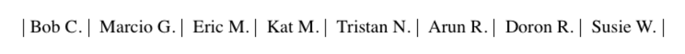
</div>
<p align="center">图 7-3：Changing the display role from list-item to inline</p>

There are plenty of other ways to use display to your advantage in design. Be creative and see what you can invent!

还有很多其他的方法可以让你在设计中充分利用显示器。要有创意，看看你能发明什么!

Be careful to note, however, that you are changing the display role of elements—not changing their inherent nature. In other words, causing a paragraph to generate an inline box does `not` turn that paragraph into an inline element. In HTML, for example, some elements are block while others are inline. (Still others are “flow” elements, but we’re ignoring them right now.) An inline element can be a descendant of a block element, but the reverse is generally not true. While a `span` can be placed inside a paragraph, a `span` cannot be wrapped around a paragraph. This will hold true no matter how you style the elements in question. Consider the following markup:

但是要注意，您正在更改元素的显示角色—而不是更改它们的固有性质。换句话说，使一个段落生成内联框并不会将该段落转换为内联元素。例如，在 HTML 中，一些元素是块，而另一些元素是内联的。(还有一些是“流”元素，但是我们现在忽略了它们。)内联元素可以是块元素的后代，但通常不是。虽然 span 可以放在段落中，但 span 不能包裹在段落中。这将适用于无论您如何样式的元素的问题。考虑以下标记:

```html
<span style="display: block;">
  <p style="display: inline;">this is wrong!</p>
</span>
```

The markup will not validate because the block element (`p`) is nested inside an inline element (`span`). The changing of display roles does nothing to change this. `display` has its name because it affects how the element is displayed, not because it changes what kind of element it is.

由于块元素(`p`)嵌套在内联元素(`span`)中，所以标记将不会生效。改变显示角色并不能改变这一点。`display` 之所以有它的名字，是因为它影响元素的显示方式，而不是因为它改变了元素的类型。

With that said, let’s get into the details of different kinds of boxes: block boxes, inline boxes, inline-block boxes, and list-item boxes

说到这里，让我们来看看不同类型的框的详细信息:块框、内联框、内联块框和列表项框

### 7.2.2 Block Boxes

Block boxes can behave in sometimes predictable, sometimes surprising ways. The handling of box placement along the horizontal and vertical axes can differ, for example. In order to fully understand how block boxes are handled, you must clearly understand a number of boundaries and areas. They are shown in detail in Figure 7-4.

块盒的行为有时是可预测的，有时是令人惊讶的。例如，沿水平轴和垂直轴放置框的处理可能不同。为了完全理解如何处理块盒，您必须清楚地理解许多边界和区域。它们在图 7-4 中详细显示。

By default, the `width` of a block box is defined to be the distance from the left inner edge to the right inner edge, and the `height` is the distance from the inner top to the inner bottom. Both of these properties can be applied to an element generating a block box.

默认情况下，块框的宽度定义为从左内边到右内边的距离，高度定义为从内顶到内底的距离。这两个属性都可以应用于生成块框的元素。

<div style="margin: 0 auto; width: 70%;">
  
</div>
<p align="center">图 7-4：The complete box model</p>

It’s also the case that we can alter how these properties are treated using the property `box-sizing`.

也可以使用属性 `box-sizing` 属性改变这些属性的处理方式。

//

This property is how you change what the `width` and `height` values actually do. If you declare `width: 400px` and don’t declare a value for `box-sizing`, then the element’s content box will be 400 pixels wide; any padding, borders, and so on will be added to it. If, on the other hand, you declare `box-sizing: border-box`, then the element box will be 400 pixels from the left outer border edge to the right outer border edge; any border or padding will be placed within that distance, thus shrinking the width of the content area. This is illustrated in Figure 7-5.

此属性用于更改宽度和高度值的实际作用。如果您声明 `width: 400px`，而没有声明 `box-sizing` 值，那么元素的内容框将是 400 像素宽;任何内边距、边框等都将被添加到其中。另一方面，如果您声明 `box-sizing: border-box`，则元素框将从左外边框边缘到右外边框边缘的距离为 400 像素;任何边框或填充将被放置在该距离内，从而缩小内容区域的宽度。如图 7-5 所示。

<div style="margin: 0 auto; width: 70%;">
  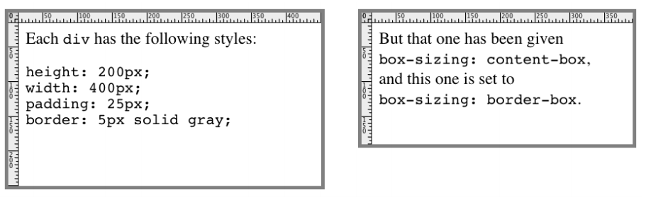
</div>
<p align="center">图 7-5：The effects of box-sizing</p>

We’re talking about the `box-sizing` property here because, as stated, it applies to “all elements that accept `width` or `height` values.” That’s most often elements generating block boxes, though it also applies to replaced inline elements like images, as well as inline-block boxes.

我们在这里讨论 `box-sizing` 属性，因为如前所述，它适用于“接受宽度或高度值的所有元素”。这是最常见的生成块框的元素，尽管它也适用于像图像这样的被替换的内联元素，以及内联块框。

The various widths, heights, padding, and margins all combine to determine how a document is laid out. In most cases, the height and width of the document are automatically determined by the browser and are based on the available display region, plus other factors. With CSS, you can assert more direct control over the way elements are sized and displayed.

不同的宽度、高度、填充和边距组合在一起决定了文档的布局方式。在大多数情况下，文档的高度和宽度由浏览器自动决定，并基于可用的显示区域和其他因素。使用 CSS，您可以对元素的大小和显示方式进行更直接的控制。

### 7.2.3 Horizontal Formatting

Horizontal formatting is often more complex than you’d think. Part of the complexity has to do with the default behavior of `box-sizing`. With the default value of `content-box`, the value given for width affects the `width` of the content area, `not` the entire visible element box. Consider the following example:

水平格式通常比您想象的更复杂。部分复杂性与 `box-sizing` 的默认行为有关。使用默认值 `content-box`，指定的宽度值将影响内容区域的 `width`，而不是整个可见元素框的 `width`。考虑下面的例子:

```html
<p style="width: 200px;">wideness?</p>
```

This will make the paragraph’s content 200 pixels wide. If we give the element a background, this will be quite obvious. However, any padding, borders, or margins you specify are `added` to the width value. Suppose we do this:

这将使段落的内容宽 200 像素。如果我们给元素一个背景，这将是非常明显的。但是，您指定的任何内边距、边框或边距都将“添加”到宽度值中。假设我们这样做:

```html
<p style="width: 200px; padding: 10px; margin: 20px;">wideness?</p>
```

The visible element box is now 220 pixels wide, since we’ve added 10 pixels of padding to the right and left of the content. The margins will now extend another 20 pixels to both sides for an overall element box width of 260 pixels. This is illustrated in Figure 7-6.

可视元素框现在是 220 像素宽，因为我们已经在内容的左右两边添加了 10 个像素的填充。页边距现在将向两边增加 20 个像素，使整个元素框的宽度增加到 260 个像素。如图 7-6 所示。

<div style="margin: 0 auto; width: 70%;">
  
</div>
<p align="center">图 7-6：Additive padding and margin</p>

If we change the styles to use the border box for box-sizing, then the results would be different. In that case, the visible box would be 200 pixels wide with a content width of 180 pixels, and a total of 40 pixels of margin to the sides, giving an overall box width of 240 pixels, as illustrated in Figure 7-7.

如果我们更改样式以使用边框框进行 box-sizing，那么结果将会不同。在这种情况下，可视框的宽度为 200 像素，内容宽度为 180 像素，边缘距为 40 像素，总体框宽为 240 像素，如图 7-7 所示。

<div style="margin: 0 auto; width: 70%;">
  
</div>
<p align="center">图 7-7：Subtracted padding</p>

In either case, there is a rule that says that the sum of the horizontal components of a block box in the normal flow always equals the width of the containing block. Let’s consider two paragraphs within a `div` whose margins have been set to be `1em`, and whose `box-sizing` value is the default. The content width (the value of `width`) of each paragraph, plus its left and right padding, borders, and margins, always adds up to the width of the `div`’s content area.

在这两种情况下，都有一个规则，该规则表示正常流中块盒的水平组件的总和总是等于包含块的宽度。让我们考虑“div”中的两个段落，它们的空白被设置为“1em”，并且它们的 `box-sizing` 值是默认值。每个段落的内容宽度(`width` 的值)，加上它的左右边距、边框和边距，总和总是 `div` 容区域的宽度。

Let’s say the width of the `div` is `30em`. That makes the sum total of the content width, padding, borders, and margins of each paragraph 30 em. In Figure 7-8, the “blank” space around the paragraphs is actually their margins. If the `div` had any padding, there would be even more blank space, but that isn’t the case here.

假设 div 的宽度是 30em。这使得每个段落的内容宽度、填充、边框和边距的总和为 30 em。在图 7-8 中，段落周围的“空白”空间实际上是它们的边距。如果“div”有任何内边距，就会有更多的空白，但这里不是这样。

<div style="margin: 0 auto; width: 70%;">
  
</div>
<p align="center">图 7-8：Element boxes are as wide as the width of their containing block</p>

### 7.2.4 Horizontal Properties

The seven properties of horizontal formatting are `margin-left`, `border-left`, `padding-left`, `width`, `padding-right`, `border-right`, and `margin-right`. These properties relate to the horizontal layout of block boxes and are diagrammed in Figure 7-9.

水平格式的七个属性是 `margin-left`, `border-left`, `padding-left`, `width`, `padding-right`, `border-right`, 和 `margin-right`。这些属性与块盒的水平布局有关，如图 7-9 所示。

The values of these seven properties must add up to the width of the element’s containing block, which is usually the value of `width` for a block element’s parent (since block-level elements nearly always have block-level elements for parents).

这七个属性的值必须加起来等于元素所包含的块的宽度，它通常是块元素的父元素的“宽度”的值(因为块级别的元素几乎总是有块级别的父元素)。

Of these seven properties, only three may be set to `auto`: the width of the element’s content and the left and right margins. The remaining properties must be set either to specific values or default to a width of zero. Figure 7-10 shows which parts of the box can take a value of auto and which cannot.

在这七个属性中，只有三个可以设置为“auto”:元素内容的宽度和左右边距。其余的属性必须设置为特定的值或默认宽度为 0。图 7-10 显示了框中的哪些部分可以接受 auto 值，哪些不能。

<div style="margin: 0 auto; width: 70%;">
  
</div>
<p align="center">图 7-9：The seven properties of horizontal formatting</p>

<div style="margin: 0 auto; width: 70%;">
  
</div>
<p align="center">图 7-10：Horizontal properties that can be set to auto</p>

`width` must either be set to `auto` or a nonnegative value of some type. When you do use `auto` in horizontal formatting, different effects can occur.

“宽度”必须设置为“自动”或某种类型的非负值。当你在水平格式中使用“auto”时，会出现不同的效果。

### 7.2.5 Using auto

If you set `width`, `margin-left`, or `margin-right` to a value of `auto`, and give the remaining two properties specific values, then the property that is set to `auto` is set to the length required to make the element box’s width equal to the parent element’s width. In other words, let’s say the sum of the seven properties must equal 500 pixels, no padding or borders are set, the right margin and width are set to `100px`, and the left margin is set to `auto`. The left margin will thus be 300 pixels wide:

如果将' width '、' margin-left '或' margin-right '设置为' auto '的值，并为其余两个属性指定特定的值，则将设置为' auto '的属性设置为使元素框的宽度等于父元素宽度所需的长度。换句话说，我们假设 7 个属性的总和必须等于 500 像素，没有设置填充或边框，右边框和宽度设置为“100px”，左边框设置为“auto”。因此，左边距将为 300 像素宽:

```css
div {
  width: 500px;
}
p {
  margin-left: auto;
  margin-right: 100px;
  width: 100px;
} /* 'auto' left margin evaluates to 300px */
```

In a sense, `auto` can be used to make up the difference between everything else and the required total. However, what if all three of these properties are set to `100px` and `none` of them are set to `auto`?

从某种意义上说，“自动”可以用来弥补其他一切与所需总数之间的差异。但是，如果这三个属性都被设置为' 100px '，而' none '都被设置为' auto '呢?

In the case where all three properties are set to something other than `auto`—or, in CSS terminology, when these formatting properties have been `overconstrained`—then `margin-right` is `always` forced to be `auto`. This means that if both margins and the width are set to `100px`, then the user agent will reset the right margin to `auto`. The right margin’s width will then be set according to the rule that one `auto` value “fills in” the distance needed to make the element’s overall width equal that of its containing block. Figure 7-11 shows the result of the following markup:

如果所有三个属性都被设置为“auto”以外的值，或者，用 CSS 术语来说，当这些格式化属性被“过度约束”时，那么“margin-right”总是被强制设置为“auto”。这意味着如果边距和宽度都设置为“100px”，那么用户代理将把右边的边距重置为“auto”。然后，根据“auto”值“填充”使元素的整体宽度等于其包含块的宽度所需的距离的规则来设置右边框的宽度。图 7-11 显示了以下标记的结果:

```css
div {
  width: 500px;
}
p {
  margin-left: 100px;
  margin-right: 100px;
  width: 100px;
} /* right margin forced to be 300px */
```

<div style="margin: 0 auto; width: 70%;">
  
</div>
<p align="center">图 7-11：Overriding the margin-right setting</p>

If both margins are set explicitly, and `width` is set to `auto`, then `width` will be whatever value is needed to reach the required total (which is the content width of the parent element). The results of the following markup are shown in Figure 7-12:

如果两个边距都被显式设置，并且' width '被设置为' auto '，那么' width '将是达到所需的 total 所需的任何值(即父元素的内容宽度)。以下标记的结果如图 7-12 所示:

```css
p {
  margin-left: 100px;
  margin-right: 100px;
  width: auto;
}
```

The case shown in Figure 7-12 is the most common case, since it is equivalent to setting the margins and not declaring anything for the `width`. The result of the following markup is exactly the same as that shown in Figure 7-12:

图 7-12 所示的情况是最常见的情况，因为它相当于设置空白，而不为“宽度”声明任何内容。以下标记的结果与图 7-12 所示完全相同:

```css
p {
  margin-left: 100px;
  margin-right: 100px;
} /* same as before */
```

<div style="margin: 0 auto; width: 70%;">
  
</div>
<p align="center">图 7-12：Automatic width</p>

You might be wondering what happens if `box-sizing` is set to, say, `padding-box`. The discussion here tends to assume that the default of `content-box` is used, but all the same principles described here apply, which is why this section only talked about `width` and the side margins without introducing any padding or borders. The handling of `width: auto` in this section and the following sections is the same regardless of the value of box-sizing. The details of what gets placed where inside the `box-sizing`-defined box may vary, but the treatment of `auto` values does not, because `box-sizing` determines what `width` refers to, not how it behaves in relation to the margins.

您可能想知道如果将“box-sizing”设置为，比如说，“padding-box”会发生什么。这里的讨论倾向于假设使用了默认的“content-box”，但是这里描述的所有原则都适用，这就是为什么本节只讨论“width”和边距，而没有引入任何填充或边框。无论 box-sizing 值是多少，本节和以下各节中对“width: auto”的处理是相同的。在“box-sizing”定义的框中放置内容的详细信息可能会有所不同，但是对“auto”值的处理是不变的，因为“box-sizing”决定了“width”指的是什么，而不是它与边距之间的关系。

### 7.2.6 More Than One auto

Now let’s see what happens when two of the three properties (`width`, `margin-left`, and `margin-right`) are set to `auto`. If both margins are set to `auto`, as shown in the following code, then they are set to equal lengths, thus centering the element within its parent. This is illustrated in Figure 7-13.

现在让我们看看当三个属性中的两个(“width”、“margin-left”和“margin-right”)被设置为“auto”时会发生什么。如果两个边距都被设置为“auto”，如下面的代码所示，那么它们被设置为相等的长度，从而使元素处于其父元素的中心。如图 7-13 所示。

```css
div {
  width: 500px;
}
p {
  width: 300px;
  margin-left: auto;
  margin-right: auto;
}
/* each margin is 100 pixels wide, because (500-300)/2 = 100 */
```

<div style="margin: 0 auto; width: 70%;">
  
</div>
<p align="center">图 7-13：Setting an explicit width</p>

Setting both margins to equal lengths is the correct way to center elements within block boxes in the normal flow. (There are other methods to be found with flexible box and grid layout, but they’re beyond the scope of this text.)

将两个边距设置为相等的长度是将正常流中的块盒中的元素居中的正确方法。(还有其他方法可以找到灵活的框和网格布局，但它们超出了本文的范围。)

Another way of sizing elements is to set one of the margins and the `width` to `auto`. The margin set to be `auto` is reduced to zero:

另一种调整元素大小的方法是将其中一个边距和“宽度”设置为“auto”。设置为“自动”的空白被减少到零:

```css
div {
  width: 500px;
}
p {
  margin-left: auto;
  margin-right: 100px;
  width: auto;
} /* left margin evaluates to 0; width becomes 400px */
```

The `width` is then set to the value necessary to make the element fill its containing block; in the preceding example, it would be 400 pixels, as shown in Figure 7-14.

然后将“宽度”设置为使元素填充其包含块所需的值;在前面的示例中，它将是 400 像素，如图 7-14 所示。

<div style="margin: 0 auto; width: 70%;">
  
</div>
<p align="center">图 7-14：What happens when both the width and right margin are auto</p>

Finally, what happens when all three properties are set to `auto`? The answer: both margins are set to zero, and the `width` is made as wide as possible. This result is the same as the default situation, when no values are explicitly declared for margins or the width. In such a case, the margins default to zero and the `width` defaults to `auto`.

最后，当所有三个属性都被设置为 `auto` 时会发生什么?答案是:两个边距都设置为 0，“宽度”尽可能宽。此结果与默认情况相同，即未显式声明空白或宽度值。在这种情况下，margin 默认为 0,width 默认为 auto。

Note that since horizontal margins do not collapse, the padding, borders, and margins of a parent element can affect its children. The effect is indirect in that the margins (and so on) of an element can induce an offset for child elements. The results of the following markup are shown in Figure 7-15:

注意，由于水平边距不会折叠，所以父元素的填充、边框和边距会影响其子元素。这种影响是间接的，因为一个元素的边距(等等)会导致子元素的偏移。以下标记的结果如图 7-15 所示:

```css
div {
  padding: 50px;
  background: silver;
}
p {
  margin: 30px;
  padding: 0;
  background: white;
}
```

<div style="margin: 0 auto; width: 70%;">
  
</div>
<p align="center">图 7-15：Offset is implicit in the parent’s margins and padding</p>

### 7.2.7 Negative Margins

So far, this may all seem rather straightforward, and you may be wondering why I said things could be complicated. Well, there’s another side to margins: the negative side. That’s right, it’s possible to set negative values for margins. Setting negative margins can result in some interesting effects.

到目前为止，这一切可能看起来相当简单，您可能想知道为什么我说事情可能很复杂。当然，边距还有另外一面:负面。是的，可以为边距设置负值。设置负的边距会产生一些有趣的效果。

Remember that the total of the seven horizontal properties always equals the `width` of the parent element. As long as all properties are zero or greater, an element can never be wider than its parent’s content area. However, consider the following markup, depicted in Figure 7-16:

记住，七个水平属性的总和总是等于父元素的“宽度”。只要所有属性都为 0 或更大，元素的宽度就不可能超过其父元素的内容区域。但是，考虑图 7-16 所示的如下标记:

```css
div {
  width: 500px;
  border: 3px solid black;
}
p.wide {
  margin-left: 10px;
  width: auto;
  margin-right: -50px;
}
```

<div style="margin: 0 auto; width: 70%;">
  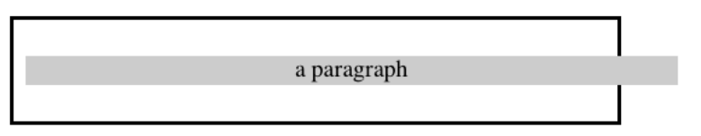
</div>
<p align="center">图 7-16：Wider children through negative margins</p>

Yes indeed, the child element is wider than its parent! This is mathematically correct:

的确，子元素比父元素更宽!这在数学上是正确的:

```css
10px + 0 + 0 + 540px + 0 + 0 − 50px = 500px
```

The `540px` is the evaluation of `width: auto`, which is the number needed to balance out the rest of the values in the equation. Even though it leads to a child element sticking out of its parent, the specification hasn’t been violated because the values of the seven properties add up to the required total. It’s a semantic dodge, but it’s valid behavior.

“540px”是“width: auto”的值，它是平衡方程中其余值所需的数字。即使它会导致一个子元素突出其父元素，也没有违反规范，因为这七个属性的值加起来就是所需的总和。这是一种语义上的躲避，但它是有效的行为。

Now, let’s add some borders to the mix:

现在，让我们添加一些边界的混合:

```css
div {
  width: 500px;
  border: 3px solid black;
}
p.wide {
  margin-left: 10px;
  width: auto;
  margin-right: -50px;
  border: 3px solid gray;
}
```

The resulting change will be a reduction in the evaluated width of `width`:

由此产生的变化将减少“宽度”的评估宽度:

```css
10px + 3px + 0 + 534px + 0 + 3px − 50px = 500px
```

If we were to introduce padding, then the value of `width` would drop even more.

如果我们引入了 padding，那么 width 的值会下降更多。

Conversely, it’s possible to have `auto` right margins evaluate to negative amounts. If the values of other properties force the right margin to be negative in order to satisfy the requirement that elements be no wider than their containing block, then that’s what will happen. Consider:

相反，也有可能使“自动”右边缘值为负值。如果其他属性的值强制右边界为负，以满足元素宽度不超过其包含块的要求，那么就会发生这种情况。考虑:

```css
div {
  width: 500px;
  border: 3px solid black;
}
p.wide {
  margin-left: 10px;
  width: 600px;
  margin-right: auto;
  border: 3px solid gray;
}
```

The equation will work out like this:

```css
10px + 3px + 0 + 600px + 0 + 3px − 116px = 500px
```

The right margin will evaluate to `-116px`. Even if we’d given it a different explicit value, it would still be forced to `-116px` because of the rule stating that when an element’s dimensions are overconstrained, the right margin is reset to whatever is needed to make the numbers work out correctly. (Except in right-to-left languages, where the left margin would be overruled instead.)

右边的空白将被赋值为' -116px '。即使我们给它一个不同的显式值，它仍然会被强制设置为' -116px '，因为规则规定当元素的维度被过度约束时，右边框会被重置为使数字正确计算所需的任何值。(除了从右到左的语言，在这种语言中，左边的空白将被取消。)

Let’s consider another example, illustrated in Figure 7-17, where the left margin is set to be negative:

让我们考虑另一个例子，如图 7-17 所示，其中左边距设置为负数:

```css
div {
  width: 500px;
  border: 3px solid black;
}
p.wide {
  margin-left: -50px;
  width: auto;
  margin-right: 10px;
  border: 3px solid gray;
}
```

<div style="margin: 0 auto; width: 70%;">
  
</div>
<p align="center">图 7-17：Setting a negative left margin</p>

With a negative left margin, not only does the paragraph spill beyond the borders of the `div`, but it also spills beyond the edge of the browser window itself!

如果左页边距为负，不仅段落会溢出“div”的边框，而且还会溢出浏览器窗口本身的边缘!

Remember that padding, borders, and content widths (and heights) can never be negative. Only margins can be less than zero.

请记住，填充、边框和内容宽度(和高度)不可能是负的。只有边距可以小于零。

### 7.2.8 Percentages

When it comes to percentage values for the width, padding, and margins, the same basic rules apply. It doesn’t really matter whether the values are declared with lengths or percentages.

当涉及到宽度、填充和边距的百分比值时，应用相同的基本规则。值是否用长度或百分比声明并不重要。

Percentages can be very useful. Suppose we want an element’s content to be twothirds the width of its containing block, the right and left padding to be 5% each, the left margin to be 5%, and the right margin to take up the slack. That would be written something like:

百分比非常有用。假设我们想要一个元素的内容是其包含块宽度的三分之二，左右边距各为 5%，左边距为 5%，右边距为 5%。大概是这样的:

```html
<p
  style="width: 67%; padding-right: 5%; padding-left: 5%; margin-right: auto;
 margin-left: 5%;"
>
  playing percentages
</p>
```

The right margin would evaluate to 18% (100% - 67% - 5% - 5% - 5%) of the width of the containing block.

右边的边距为包含块宽度的 18%(100% - 67% - 5% - 5% - 5%)。

Mixing percentages and length units can be tricky, however. Consider the following example:

然而，混合百分比和长度单位可能比较棘手。考虑下面的例子:

```html
<p
  style="width: 67%; padding-right: 2em; padding-left: 2em; margin-right: auto;
 margin-left: 5em;"
>
  mixed lengths
</p>
```

In this case, the element’s box can be defined like this:

在这种情况下，元素的框可以这样定义:

```css
5em + 0 + 2 em + 67% + 2 em + 0 + auto = containing block width
```

In order for the right margin’s width to evaluate to zero, the element’s containing block must be 27.272727 em wide (with the content area of the element being 18.272727 em wide). Any wider than that and the right margin will evaluate to a positive value. Any narrower and the right margin will be a negative value.

为了使右边框宽度的值为 0，元素的包含块宽度必须为 27.272727 em(元素的内容区域宽度为 18.272727 em)。任何比这更宽的边和右边的边都是正值。任何较窄的右边界都将是负值。

The situation gets even more complicated if we start mixing length-value unity types, like this:

如果我们开始混合长度值统一类型，情况会变得更加复杂，就像这样:

```html
<p
  style="width: 67%; padding-right: 15px; padding-left: 10px;
 margin-right: auto;
 margin-left: 5em;"
>
  more mixed lengths
</p>
```

And, just to make things more complex, borders cannot accept percentage values, only length values. The bottom line is that it isn’t really possible to create a fully flexible element based solely on percentages unless you’re willing to avoid using borders or use some of the more experimental approaches such as flexible box layout.

### 7.2.9 Replaced Elements

So far, we’ve been dealing with the horizontal formatting of nonreplaced block boxes in the normal flow of text. Block-level replaced elements are a bit simpler to manage. All of the rules given for nonreplaced blocks hold true, with one exception: if `width` is `auto`, then the `width` of the element is the content’s intrinsic width. The image in the following example will be 20 pixels wide because that’s the width of the original image:

更复杂的是，边框不能接受百分比值，只能接受长度值。底线是，除非您愿意避免使用边框或使用一些更具实验性的方法，如灵活的框布局，否则完全不可能仅根据百分比创建完全灵活的元素。

```html

```

If the actual image were 100 pixels wide instead, then it would be laid out as 100 pixels wide. It’s possible to override this rule by assigning a specific value to `width`. Suppose wemodify the previous example to show the same image three times, each with a different width value:

如果实际图像的宽度是 100 像素，那么它将被设置为 100 像素宽。可以通过为“width”指定一个特定的值来覆盖这个规则。假设我们对前面的例子进行三次相同的图像显示，每个图像具有不同的宽度值:

```html


```

This is illustrated in Figure 7-18.

如图 7-18 所示。

Note that the height of the elements also increases. When a replaced element’s `width` is changed from its intrinsic width, the value of `height` is scaled to match, unless `height` has been set to an explicit value of its own. The reverse is also true: if `height` is set, but `width` is left as `auto`, then the width is scaled proportionately to the change in height.

注意，元素的高度也会增加。当被替换的元素的“宽度”从其固有宽度更改时，将缩放“高度”的值以匹配它，除非将“高度”设置为其自身的显式值。反过来也是正确的:如果' height '被设置，但是' width '被保留为' auto '，那么宽度将根据高度的变化比例调整。

<div style="margin: 0 auto; width: 70%;">
  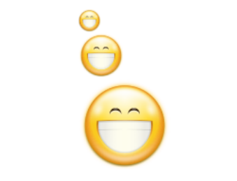
</div>
<p align="center">图 7-18：Changing replaced element widths</p>

Now that you’re thinking about height, let’s move on to the vertical formatting of normal-flow block box.

现在您考虑的是高度，让我们继续正常流块框的垂直格式。

### 7.2.10 Vertical Formatting

Like horizontal formatting, the vertical formatting of block boxes has its own set of interesting behaviors. An element’s content determines the default height of an `element`. The width of the content also affects height; the skinnier a paragraph becomes, for example, the taller it has to be in order to contain all of the inline content within it.

与水平格式一样，块盒的垂直格式也有自己的一组有趣的行为。元素的内容决定了“元素”的默认高度。内容的宽度也影响高度;例如，一个段落越窄，为了包含所有的内联内容，它就必须越高。

In CSS, it is possible to set an explicit height on any block-level element. If you do this, the resulting behavior depends on several other factors. Assume that the specified height is greater than that needed to display the content:

在 CSS 中，可以在任何块级别的元素上设置显式的高度。如果这样做，结果的行为取决于其他几个因素。假设指定的高度大于显示内容所需的高度:

```html
<p style="height: 10em;"></p>
```

In this case, the extra height has a visual effect somewhat like extra padding. But suppose the height is `less` than what is needed to display the content:

在本例中，额外的高度具有类似于额外填充的视觉效果。但是假设高度“小于”显示内容所需的高度:

```html
<p style="height: 3.33em;"></p>
```

When that happens, the browser is supposed to provide a means of viewing all content without increasing the height of the element box. In a case where the content of an element is taller than the height of its box, the actual behavior of a user agent will depend on the value of the property `overflow`. Two alternatives are shown in Figure 7-19.

当这种情况发生时，浏览器应该提供一种查看所有内容的方法，而不需要增加元素框的高度。在元素的内容比其框的高度高的情况下，用户代理的实际行为将取决于属性“overflow”的值。图 7-19 显示了两个备选方案。

Under CSS1, user agents can ignore any value of `height` other than `auto` if an element is not a replaced element (such as an image). In CSS2 and later, the value of `height` cannot be ignored, except in one specific circumstance involving percentage values. We’ll talk about that in a moment.

在 CSS1 下，如果一个元素不是被替换的元素(比如一个图像)，用户代理可以忽略除“auto”之外的任何“height”值。在 CSS2 及以后的版本中，“高度”的值不能被忽略，除非在一个特定的情况下涉及到百分比值。我们一会儿会讲到。

Just as with `width`, `height` defines the content area’s height by default, as opposed to the height of the visible element box. Any padding, borders, or margins on the top or bottom of the element box are `added` to the value for height, unless the value of `box-sizing` is different than `content-box`.

与“width”一样，“height”默认定义内容区域的高度，而不是可视元素框的高度。元素框的顶部或底部的任何内边距、边框或边距都将“添加”到高度值中，除非“box-sizing”的值与“content-box”不同。

<div style="margin: 0 auto; width: 70%;">
  
</div>
<p align="center">图 7-19：Heights that don’t match the element’s content height</p>

### 7.2.11 Vertical Properties

As was the case with horizontal formatting, vertical formatting also has seven related properties: `margin-top`, `border-top`, `padding-top`, `height`, `padding-bottom`, `border-bottom`, and `margin-bottom`. These properties are diagrammed in Figure 7-20.

与水平格式一样，垂直格式也有七个相关属性:`margin-top`, `border-top`, `padding-top`, `height`, `padding-bottom`, `border-bottom`, 和 `margin-bottom`。这些属性如图 7-20 所示。

The values of these seven properties must equal the height of the block box’s containing block. This is usually the value of `height` for a block box’s parent (since blocklevel elements nearly always have block-level elements for parents).

这七个属性的值必须等于包含块的块的高度。这通常是块盒的父块的“高度”值(因为块级别的元素几乎总是有块级别的父块元素)。

Only three of these seven properties may be set to `auto`: the `height` of the element, and the top and bottom margins. The top and bottom padding and borders must be set to specific values or else they default to a width of zero (assuming no `border-style` is declared). If border-style has been set, then the thickness of the borders is set to be the vaguely defined value `medium`. Figure 7-21 provides an illustration for remembering which parts of the box may have a value of `auto` and which may not.

这七个属性中只有三个可以设置为“auto”:元素的“height”，以及顶部和底部的边距。顶部和底部的填充和边框必须设置为特定的值，否则它们的默认宽度为 0(假设没有声明“border-style”)。如果已经设置了 border-style，那么边框的厚度将被设置为定义模糊的值“medium”。图 7-21 提供了一个示例，用于记住框中的哪些部分可能具有“auto”值，哪些不具有。

Interestingly, if either `margin-top` or `margin-bottom` is set to `auto` for a block box in the normal flow, they both automatically evaluate to `0`. A value of `0` unfortunately prevents easy vertical centering of normal-flow boxes in their containing blocks. It also means that if you set the top and bottom margins of an element to `auto`, they are effectively reset to `0` and removed from the element box.

有趣的是，如果“页边距顶部”或“页边距底部”被设置为“自动”，它们都会自动计算为“0”。不幸的是，“0”的值会妨碍正常流盒在其包含块中的垂直居中。这也意味着如果你将一个元素的顶部和底部的边距设置为“auto”，它们将被有效地重置为“0”并从元素框中移除。

The handling of `auto` top and bottom margins is different for positioned elements, as well as flexible-box elements.

对“自动”顶部和底部边缘的处理不同于定位元素，以及灵活的盒子元素。

<div style="margin: 0 auto; width: 70%;">
  
</div>
<p align="center">图 7-20：The seven properties of vertical formatting</p>

`height` must be set to `auto` or to a nonnegative value of some type; it can never be less than zero.

' height '必须设置为' auto '，或设置为某种类型的非负值;它永远不会小于零。

### 7.2.12 Percentage Heights

You already saw how length-value heights are handled, so let’s spend a moment on percentages. If the height of a normal-flow block box is set to a percentage value, then that value is taken as a percentage of the height of the box’s containing block. Given the following markup, the resulting paragraph will be 3 em tall:

您已经看到了如何处理长度值高度，因此让我们花一点时间来讨论百分比。如果将正常流块盒的高度设置为百分比值，则该值将作为包含该块的盒的高度的百分比。给定以下标记，得到的段落将为 3 em 高:

```html
<div style="height: 6em;">
  <p style="height: 50%;">Half as tall</p>
</div>
```

Since setting the top and bottom margins to `auto` will give them zero height, the only way to vertically center the element in this particular case would be to set them both to `25%`—and even then, the box would be centered, not the content within it.

由于将顶部和底部的边距设置为“auto”将使它们的高度为 0，因此在这种特殊情况下，将元素垂直居中的唯一方法是将它们都设置为“25%”，即使这样，方框也将居中，而不是其中的内容。

<div style="margin: 0 auto; width: 70%;">
  
</div>
<p align="center">图 7-21：Vertical properties that can be set to auto</p>

However, in cases where the height of the containing block is `not` explicitly declared, percentage heights are reset to `auto`. If we changed the previous example so that the `height` of the `div` is `auto`, the paragraph will now be exactly as tall as the `div` itself:

但是，如果未显式声明包含块的高度，则将百分比高度重置为“auto”。如果我们改变前面的例子，使' div '的' height '为' auto '，那么段落的高度将与' div '本身一样高:

```html
<div style="height: auto;">
  <p style="height: 50%;">NOT half as tall; height reset to auto</p>
</div>
```

These two possibilities are illustrated in Figure 7-22. (The spaces between the paragraph borders and the `div` borders are the top and bottom margins on the paragraphs.)

这两种可能性如图 7-22 所示。(段落边框和“div”边框之间的空间是段落的顶部和底部空白。)

<div style="margin: 0 auto; width: 70%;">
  
</div>
<p align="center">图 7-22：Percentage heights in different circumstances</p>

Before we move on, take a closer look at the first example in Figure 7-22, the half-astall paragraph. It may be half as tall, but it isn’t vertically centered. That’s because the containing `div` is 6 em tall, which means the half-as-tall paragraph is 3 em tall. It has top and bottom margins of 1 em, so its overall box height is 5 em. That means there is actually 2 em of space between the bottom of the paragraph’s visible box and the `div`’s bottom border, not 1 em. It might seem a bit odd at first glance, but it makes sense once you work through the details.

在我们继续之前，仔细看看图 7-22 中的第一个例子，half-astall 段落。它可能只有一半高，但不是垂直居中。这是因为包含的“div”是 6 em 高，这意味着半高的段落是 3 em 高。顶部和底部 1 em 的利润率,所以其总体框高度是 5。这意味着实际上是 2 他们之间的空间段的底部可见盒和 div”年代底边界,而不是 1 em。乍一看似乎有点奇怪,但它是有意义的,一旦你的工作细节。

### 7.2.13 Auto Heights

In the simplest case, a normal-flow block box with `height: auto` is rendered just high enough to enclose the line boxes of its inline content (including text). If an autoheight, normal-flow block box has only block-level children, then its default height will be the distance from the top of the topmost block-level child’s outer border edge to the bottom of the bottommost block-level child’s outer bottom border edge. Therefore, the margins of the child elements will “stick out” of the element that contains them. (This behavior is explained in the next section.)

在最简单的情况下，具有“height: auto”的正常流块框的呈现高度刚好能够将其内联内容(包括文本)的行框括起来。如果一个 autoheight, normal-flow 块框只有块级别的子元素，那么它的默认高度将是最顶层块级别子元素的外边框边缘到最底层块级别子元素的外边框边缘底部的距离。因此，子元素的边距将“突出”于包含它们的元素之外。(下一节将解释这种行为。)

However, if the block-level element has either top or bottom padding, or top or bottom borders, then its height will be the distance from the top of the outer-top margin edge of its topmost child to the outer-bottom margin edge of its bottommost child:

但是，如果块级元素有顶部或底部填充，或顶部或底部边框，那么它的高度将是其最顶层的子元素的外边缘边缘到其最底端的子元素的外边缘边缘之间的距离:

```html
<div
  style="height: auto;
 background: silver;"
>
  <p style="margin-top: 2em; margin-bottom: 2em;">A paragraph!</p>
</div>
<div
  style="height: auto; border-top: 1px solid; border-bottom: 1px solid;
 background: silver;"
>
  <p style="margin-top: 2em; margin-bottom: 2em;">Another paragraph!</p>
</div>
```

Both of these behaviors are demonstrated in Figure 7-23.

图 7-23 展示了这两种行为。

If we changed the borders in the previous example to padding, the effect on the height of the `div` would be the same: it would still enclose the paragraph’s margins within it.

如果我们将前一个示例中的边框改为 padding，那么对“div”高度的影响将是相同的:它仍然将段落的边距括在其中。

<div style="margin: 0 auto; width: 70%;">
  
</div>
<p align="center">图 7-23：Auto heights with block-level children</p>

### 7.2.14 Collapsing Vertical Margins

One other important aspect of vertical formatting is the `collapsing` of vertically adjacent margins. Collapsing behavior applies only to margins. Padding and borders, where they exist, never collapse with anything.

垂直格式的另一个重要方面是相邻页边距的“折叠”。崩溃行为只适用于边缘。填充和边框，它们存在的地方，永远不会因为任何东西而崩溃。

An unordered list, where list items follow one another, is a perfect example of margin collapsing. Assume that the following is declared for a list that contains five items:

无序列表(其中列表项彼此跟随)是空白折叠的一个完美示例。假设包含 5 个项目的列表声明如下:

```css
li {
  margin-top: 10px;
  margin-bottom: 15px;
}
```

Each list item has a 10-pixel top margin and a 15-pixel bottom margin. When the list is rendered, however, the distance between adjacent list items is 15 pixels, not 25. This happens because, along the vertical axis, adjacent margins are collapsed. In other words, the smaller of the two margins is eliminated in favor of the larger. Figure 7-24 shows the difference between collapsed and uncollapsed margins.

每个列表项都有一个 10 像素的顶部空白和一个 15 像素的底部空白。然而，在呈现列表时，相邻列表项之间的距离为 15 像素，而不是 25 像素。这是因为，沿着纵轴，相邻的边会折叠。换句话说，两个边距中较小的边距被较大的边距所取代。图 7-24 显示了折叠和未折叠的边缘之间的差异。

Correctly implemented user agents collapse vertically adjacent margins, as shown in the first list in Figure 7-24, where there are 15-pixel spaces between each list item. The second list shows what would happen if the user agent didn’t collapse margins, resulting in 25-pixel spaces between list items.

正确实现的用户代理垂直折叠相邻的边距，如图 7-24 中的第一个列表所示，其中每个列表项之间有 15 个像素的空格。第二个列表显示了如果用户代理没有折叠页边距会发生什么，从而在列表项之间产生 25 像素的空格。

Another word to use, if you don’t like “collapse,” is “overlap.” Although the margins are not really overlapping, you can visualize what’s happening using the following analogy.

如果你不喜欢“折叠”，可以用“重叠”这个词。虽然边缘没有重叠，但你可以用下面的类比来想象发生了什么。

Imagine that each element, such as a paragraph, is a small piece of paper with the content of the element written on it. Around each piece of paper is some amount of clear plastic, which represents the margins. The first piece of paper (say an `h1` piece) is laid down on the canvas. The second (a paragraph) is laid below it and then slid up until the edge of one of the piece’s plastic touches the edge of the other’s paper. If the first piece of paper has half an inch of plastic along its bottom edge, and the second has a third of an inch along its top, then when they slide together, the first piece’s plastic will touch the top edge of the second piece of paper. The two are now done being placed on the canvas, and the plastic attached to the pieces is overlapping.

假设每个元素(比如一个段落)都是一张写有元素内容的小纸片。每张纸的周围都有一定数量的透明塑料，代表着纸的边缘。第一张纸(假设一张 h1)放在画布上。第二段(一段)放在它的下面，然后向上滑动，直到其中一个塑料的边缘接触到另一个纸的边缘。如果第一张纸的下沿有半英寸的塑料，第二张纸的上沿有三分之一英寸的塑料，那么当它们一起滑动时，第一张纸的塑料就会碰到第二张纸的上沿。现在，这两件作品被放在画布上，与作品相连的塑料也被重叠起来。

<div style="margin: 0 auto; width: 70%;">
  
</div>
<p align="center">图 7-24：Collapsed versus uncollapsed margins</p>

Collapsing also occurs where multiple margins meet, such as at the end of a list.Adding to the earlier example, let’s assume the following rules apply:

当多个页边距相遇时，例如在列表末尾，也会发生折叠。在前面的例子中，我们假设以下规则适用:

```css
ul {
  margin-bottom: 15px;
}
li {
  margin-top: 10px;
  margin-bottom: 20px;
}
h1 {
  margin-top: 28px;
}
```

The last item in the list has a bottom margin of 20 pixels, the bottom margin of the `ul` is 15 pixels, and the top margin of a succeeding `h1` is 28 pixels. So once the margins have been collapsed, the distance between the end of the `li` and the beginning of the `h1` is 28 pixels, as shown in Figure 7-25.

列表中的最后一项的底部空白为 20 像素，“ul”的底部空白为 15 像素，“h1”的后续顶部空白为 28 像素。因此，一旦边缘折叠起来，“li”的末端和“h1”的开始之间的距离就是 28 像素，如图 7-25 所示。

<div style="margin: 0 auto; width: 70%;">
  
</div>
<p align="center">图 7-25：Collapsing in detail</p>

Now, recall the examples from the previous section, where the introduction of a border or padding on a containing block would cause the margins of its child elements to be contained within it. We can see this behavior in operation by adding a border to the `ul` element in the previous example:

现在，回想一下上一节的例子，在这个例子中，在一个包含块上引入边框或填充会导致它的子元素的边距被包含在其中。我们可以看到这种行为在操作中添加一个边框到' ul '元素在前面的例子:

```css
ul {
  margin-bottom: 15px;
  border: 1px solid;
}
li {
  margin-top: 10px;
  margin-bottom: 20px;
}
h1 {
  margin-top: 28px;
}
```

With this change, the bottom margin of the `li` element is now placed inside its parent element (the `ul`). Therefore, the only margin collapsing that takes place is between the `ul` and the `h1`, as illustrated in Figure 7-26.

通过这个更改，' li '元素的底部空白现在被放置在其父元素(' ul ')中。因此，唯一发生的边缘崩溃是在“ul”和“h1”之间，如图 7-26 所示。

<div style="margin: 0 auto; width: 70%;">
  
</div>
<p align="center">图 7-26：Collapsing (or not) with borders added to the mix</p>

### 7.2.15 Negative Margins and Collapsing

Negative margins do have an impact on vertical formatting, and they affect how margins are collapsed. If negative vertical margins are set, then the browser should take the absolute maximum of both margins. The absolute value of the negative margin is then subtracted from the positive margin. In other words, the negative is added to the positive, and the resulting value is the distance between the elements. Figure 7-27 provides two concrete examples.

负页边距确实会对垂直格式产生影响，并影响页边距的折叠方式。如果设置了负的垂直边距，那么浏览器应该取两个边距的绝对最大值。然后从正保证金中减去负保证金的绝对值。换句话说，负的和正的相加，得到的值就是元素之间的距离。图 7-27 提供了两个具体的例子。

<div style="margin: 0 auto; width: 70%;">
  
</div>
<p align="center">图 7-27：Examples of negative vertical margins</p>

Notice the “pulling” effect of negative top and bottom margins. This is really no different from the way that negative horizontal margins cause an element to push outside of its parent. Consider:

注意“拉”的负面顶部和底部边缘的影响。这与负水平边距导致元素向父元素外推没什么不同。考虑:

```css
p.neg {
  margin-top: -50px;
  margin-right: 10px;
  margin-left: 10px;
  margin-bottom: 0;
  border: 3px solid gray;
}
```

```html
<div
  style="width: 420px; background-color: silver; padding: 10px;
 margin-top: 50px; border: 1px solid;"
>
  <p class="neg">
    A paragraph.
  </p>
  A div.
</div>
```

As we see in Figure 7-28, the paragraph has been pulled upward by its negative top margin. Note that the content of the `div` that follows the paragraph in the markup has also been pulled upward 50 pixels. In fact, every bit of normal-flow content that follows the paragraph is also pulled upward 50 pixels.

正如我们在图 7-28 中所看到的，该段已被其负上边距向上拉。请注意，标记中段落后面的“div”的内容也向上拉了 50 个像素。事实上，段落后面的每一个正常流内容都被向上拉了 50 个像素。

<div style="margin: 0 auto; width: 70%;">
  
</div>
<p align="center">图 7-28：The effects of a negative top margin</p>

Now compare the following markup to the situation shown in Figure 7-29:

现在将下面的标记与图 7-29 中的情况进行比较:

```css
p.neg {
  margin-bottom: -50px;
  margin-right: 10px;
  margin-left: 10px;
  margin-top: 0;
  border: 3px solid gray;
}
```

```html
<div style="width: 420px; margin-top: 50px;">
  <p class="neg">
    A paragraph.
  </p>
</div>
<p>
  The next paragraph.
</p>
```

<div style="margin: 0 auto; width: 70%;">
  
</div>
<p align="center">图 7-29：The effects of a negative bottom margin</p>

What’s really happening in Figure 7-29 is that the elements following the `div` are placed according to the location of the bottom of the `div`. As you can see, the end of the `div` is actually above the visual bottom of its child paragraph. The next element after the `div` is the appropriate distance from the bottom of the `div`. This is expected, given the rules we saw.

在图 7-29 中真正发生的是“div”后面的元素是根据“div”底部的位置放置的。如您所见，“div”的结尾实际上位于其子段落的可视底部之上。' div '后面的下一个元素是' div '底部的适当距离。考虑到我们看到的规则，这是意料之中的。

Now let’s consider an example where the margins of a list item, an unordered list, and a paragraph are all collapsed. In this case, the unordered list and paragraph are assigned negative margins:

现在让我们考虑一个例子，其中一个列表项、一个无序列表和一个段落的边距都是折叠的。在这种情况下，无序列表和段落被分配了负边距:

```css
li {
  margin-bottom: 20px;
}
ul {
  margin-bottom: -15px;
}
h1 {
  margin-top: -18px;
}
```

The larger of the two negative margins (`-18px`) is added to the largest positive margin (`20px`), yielding `20px - 18px = 2px`. Thus, there are only two pixels between the bottom of the list item’s content and the top of the `h1`’s content, as we can see in Figure 7-30.

两个负边距中较大的边距(' -18px ')与最大的正边距(' 20px ')相加，得到' 20px -18px = 2px '。因此，在列表项的底部和 h1 的顶部之间只有两个像素，如图 7-30 所示。

When elements overlap each other due to negative margins, it’s hard to tell which elements are on top. You may also have noticed that none of the examples in this section use background colors. If they did, the background color of a following element might overwrite their content. This is expected behavior, since browsers usually render elements in order from beginning to end, so a normal-flow element that comes later in the document can be expected to overwrite an earlier element, assuming the two end up overlapping.

当元素由于负边距而相互重叠时，很难判断哪些元素在顶部。您可能还注意到，本节中的示例都没有使用背景颜色。如果它们这样做了，下面元素的背景颜色可能会覆盖它们的内容。这是预期的行为，因为浏览器通常按从开始到结束的顺序呈现元素，所以文档中稍后出现的正常流元素可能会覆盖前面的元素，假设两者最终会重叠。

<div style="margin: 0 auto; width: 70%;">
  
</div>
<p align="center">图 7-30：Collapsing margins and negative margins, in detail</p>

### 7.2.16 List Items

List items have a few special rules of their own. They are typically preceded by a marker, such as a small dot or a number. This marker isn’t actually part of the list item’s content area, so effects like those illustrated in Figure 7-31 are common.

列表项有自己的一些特殊规则。它们的前面通常有一个标记，比如一个小点或一个数字。此标记实际上并不属于列表项的内容区域，因此类似图 7-31 所示的效果很常见。

<div style="margin: 0 auto; width: 70%;">
  
</div>
<p align="center">图 7-31：The content of list items</p>

CSS1 said very little about the placement and effects of these markers with regard to the layout of a document. CSS2 introduced properties specifically designed to address this issue, such as `marker-offset`. However, a lack of implementations and changes in thinking caused this to be dropped from CSS2.1, and work is being done to reintroduce the idea (if not the specific syntax) to CSS. Accordingly, the placement of markers is largely beyond the control of authors, at least as of this writing.

CSS1 很少提到这些标记在文档布局中的位置和效果。CSS2 引入了专门为解决这个问题而设计的属性，比如“标记偏移”。然而，由于缺少实现和思想上的变化，导致这一概念从 CSS2.1 中删除，目前正在努力将这一概念(如果不是具体的语法)重新引入 CSS。因此，标记的位置在很大程度上超出了作者的控制，至少在撰写本文时是这样。

The marker attached to a list item element can be either outside the content of the list item or treated as an inline marker at the beginning of the content, depending on the value of the property `list-style-position`. If the marker is brought inside, then the list item will interact with its neighbors exactly like a block-level element, as illustrated in Figure 7-32.

附加到列表项元素的标记可以位于列表项的内容之外，也可以作为内容开头的内联标记，具体取决于属性 `list-style-position` 的值。如果将标记放在内部，那么列表项将与它的邻居交互，就像块级别的元素一样，如图 7-32 所示。

<div style="margin: 0 auto; width: 70%;">
  
</div>
<p align="center">图 7-32：Markers inside and outside the list</p>

If the marker stays outside the content, then it is placed some distance from the left content edge of the content (in left-to-right languages). No matter how the list’s styles are altered, the marker stays the same distance from the content edge. Occasionally, the markers may be pushed outside of the list element itself, as we can see in Figure 7-32.

如果标记位于内容之外，则将其放置在距内容的左内容边缘有一定距离的地方(在从左到右的语言中)。无论列表的样式如何更改，标记都与内容边缘保持相同的距离。有时，标记可能被推到列表元素本身之外，如图 7-32 所示。

Remember that list-item boxes define containing blocks for their ancestor boxes, just like regular block boxes.

请记住，列表项框为它们的祖先框定义了包含块，就像普通块框一样。

## 7.3 Inline Elements

After block-level elements, inline elements are the most common. Setting box properties for inline elements takes us into more interesting territory than we’ve been so far. Some good examples of inline elements are the `em` tag and the `a` tag, both of which are nonreplaced elements, and images, which are replaced elements.

除了块级元素外，内联元素是最常见的。为内联元素设置框属性将使我们进入到比目前更有趣的领域。内联元素的一些好例子是' em '标记和' a '标记，它们都是不可替换的元素，以及图像，它们都是被替换的元素。

Note that none of the behavior described in this section applies to table elements. CSS2 introduced new properties and behaviors for handling tables and table content, and these elements behave in ways fairly distinct from either block-level or inline formatting. Table styling is beyond the scope of this book, as it’s surprisingly complicated and exists rather in a world of its own.

注意，本节中描述的所有行为都不适用于表元素。CSS2 为处理表和表内容引入了新的属性和行为，这些元素的行为方式与块级或内联格式非常不同。表格样式超出了本书的范围，因为它非常复杂，并且存在于它自己的世界中。

Nonreplaced and replaced elements are treated somewhat differently in the inline context, and we’ll look at each in turn as we explore the construction of inline elements.

非替换元素和被替换元素在内联上下文中的处理方式有所不同，在探索内联元素的构造时，我们将依次查看它们。

### 7.3.1 Line Layout

First, you need to understand how inline content is laid out. It isn’t as simple as blocklevel elements, which just generate block boxes and usually don’t allow anything to coexist with them. By contrast, look `inside` a block-level element, such as a paragraph. You may well ask, how did all those lines of text get there? What controls their arrangement? How can I affect it?

首先，您需要了解内联内容是如何布局的。它不像块级元素那么简单，块级元素只生成块盒，通常不允许任何东西与它们共存。相比之下，查看块级元素(如段落)的“内部”。你可能会问，这些文字是怎么来的?是什么控制着他们的安排?我怎样才能影响它?

In order to understand how lines are generated, first consider the case of an element containing one very long line of text, as shown in Figure 7-33. Note that we’ve put a border around the line by wrapping the entire line in a `span` element and then assigning it a border style:

为了理解如何生成行，首先考虑一个元素包含一个很长的文本行，如图 7-33 所示。请注意，我们已经把整个线包围在一个' span '元素，然后分配给它一个边框样式:

```css
span {
  border: 1px dashed black;
}
```

<div style="margin: 0 auto; width: 70%;">
  
</div>
<p align="center">图 7-33：A single-line inline element</p>

Figure 7-33 shows the simplest case of an inline element contained by a block-level element. It’s no different in its way than a paragraph with two words in it. The only differences are that, in Figure 7-34, we have a few dozen words, and most paragraphs don’t contain an explicit inline element such as `span`.

图 7-33 显示了块级元素所包含的内联元素的最简单情况。这和一个只有两个词的段落没有什么不同。唯一的区别是，在图 7-34 中，我们有几十个单词，并且大多数段落不包含像‘span’这样的显式内联元素。

In order to get from this simplified state to something more familiar, all we have to do is determine how wide the element should be, and then break up the line so that the resulting pieces will fit into the content width of the element. Therefore, we arrive at the state shown in Figure 7-34.

为了从这种简化的状态过渡到更熟悉的状态，我们所要做的就是确定元素应该有多宽，然后将行分割开来，使结果块与元素的内容宽度相匹配。因此，我们得到如图 7-34 所示的状态。

<div style="margin: 0 auto; width: 70%;">
  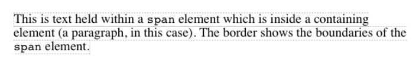
</div>
<p align="center">图 7-34：A multiple-line inline element</p>

Nothing has really changed. All we did was take the single line and break it into pieces, and then stack those pieces on top of each other.

什么都没有改变。我们所做的就是把一条线分成几块，然后把它们叠起来。

In Figure 7-34, the borders for each line of text also happen to coincide with the top and bottom of each line. This is true only because no padding has been set for the inline text. Notice that the borders actually overlap each other slightly; for example, the bottom border of the first line is just below the top border of the second line. This is because the border is actually drawn on the next pixel (assuming you’re using a monitor) to the `outside` of each line. Since the lines are touching each other, their borders will overlap as shown in Figure 7-34.

在图 7-34 中，每行文本的边框也恰好与每行的顶部和底部重合。这是因为没有为内联文本设置填充。请注意，这些边界实际上彼此略有重叠;例如，第一行的底边框刚好位于第二行的顶边框之下。这是因为边界实际上是画在下一个像素上(假设你在使用显示器)到每条线的“外部”。由于这些线相互接触，它们的边界将重叠，如图 7-34 所示。

If we alter the span styles to have a background color, the actual placement of the lines becomes quite clear. Consider Figure 7-35, which contains four paragraphs, each with a different value of `text-align` and each having the backgrounds of its lines filled in.

如果我们将 span 样式改为背景色，那么线条的实际位置将变得非常清晰。考虑图 7-35，它包含四个段落，每个段落具有不同的“text-align”值，并且每个段落的背景都被填充。

As we can see, not every line reaches to the edge of its parent paragraph’s content area, which has been denoted with a dotted gray border. For the left-aligned paragraph, the lines are all pushed flush against the left content edge of the paragraph, and the end of each line happens wherever the line is broken. The reverse is true for the right-aligned paragraph. For the centered paragraph, the centers of the lines are aligned with the center of the paragraph.

正如我们所看到的，并不是每一行都能到达其母段内容区域的边缘，该区域已经用虚线表示为灰色边框。对于左对齐的段落，所有的行都被推到与段落左内容边缘齐平的位置，每一行的结尾都出现在断行的地方。右对齐的段落则相反。对于居中段落，行中心与段落中心对齐。

In the last case, where the value of `text-align` is `justify`, each line is forced to be as wide as the paragraph’s content area so that the line’s edges touch the content edges of the paragraph. The difference between the natural length of the line and the width of the paragraph is made up by altering the spacing between letters and words in each line. Therefore, the value of `word-spacing` can be overridden when the text is justified. (The value of `letter-spacing` cannot be overridden if it is a length value.)

在最后一种情况下，“text-align”的值是“justify”，每一行都必须与段落的内容区域一样宽，以便使该行的边缘与段落的内容边缘相接触。行长度和段落宽度之间的差异是通过改变每行中字母和单词之间的间距来弥补的。因此，“单词间隔”的值可以在文本对齐时被覆盖。(如果“字母间距”是长度值，则不能重写该值。)

That pretty well covers how lines are generated in the simplest cases. As you’re about to see, however, the inline formatting model is far from simple.

这很好地涵盖了如何在最简单的情况下生成行。但是，您将看到，内联格式模型远非简单。

<div style="margin: 0 auto; width: 70%;">
  
</div>
<p align="center">图 7-35：Showing lines in different alignments</p>

### 7.3.2 Basic Terms and Concepts

Before we go any further, let’s review some basic terms of inline layout, which will be crucial in navigating the following sections:

在我们进一步讨论之前，让我们回顾一下内联布局的一些基本术语，这些术语在浏览以下部分时非常重要:

`Anonymous text`

This is any string of characters that is not contained within an inline element. Thus, in the markup `<p> I'm <em>so</em> happy!</p>`, the sequences “ I’m ” and “ happy!” are anonymous text. Note that the spaces are part of the text sincea space is a character like any other.

这是内联元素中不包含的任何字符串。因此，在标记 `I'm so happy!`，序列“I’m”和“happy!”是匿名文本。注意空格是文本的一部分，因为空格和其他字符一样都是字符。

`Em box`

This is defined in the given font, otherwise known as the character box. Actual glyphs can be taller or shorter than their em boxes. In CSS, the value of `font-size` determines the height of each em box.

这是在给定的字体中定义的，也称为字符框。实际的象形文字可以比它们的 em 盒子更高或更短。在 CSS 中，“font-size”的值决定了每个 em 框的高度。

`Content area`

In nonreplaced elements, the content area can be one of two things, and the CSS specification allows user agents to choose which one. The content area can be the box described by the em boxes of every character in the element, strung together; or it can be the box described by the character glyphs in the element. In this book, I use the em box definition for simplicity’s sake. In replaced elements, the content area is the intrinsic height of the element plus any margins, borders, or padding.

在不可替换元素中，内容区域可以是以下两种情况之一，CSS 规范允许用户代理选择其中之一。内容区域可以是元素中每个字符的 em 框所描述的框，并串在一起;也可以是元素中的字符符号所描述的方框。在本书中，为了简单起见，我使用了 em box 定义。在被替换的元素中，内容区域是元素的固有高度加上任何边距、边框或填充。

`Leading`

Leading is the difference between the values of `font-size` and `line-height`. This difference is actually divided in half and is applied equally to the top and bottom of the content area. These additions to the content area are called, not surprisingly, `half-leading`. Leading is applied only to nonreplaced elements.

前导是‘font-size’和‘line-height’值之间的差异。这种差异实际上被分成两部分，并平均应用于内容区域的顶部和底部。这些添加到内容区域的内容被称为“半导”，这并不奇怪。前导只应用于不可替换的元素。

`Inline box`

This is the box described by the addition of the leading to the content area. For nonreplaced elements, the height of the inline box of an element will be exactly equal to the value for `line-height`. For replaced elements, the height of the inline box of an element will be exactly equal to the content area, since leading is not applied to replaced elements.

这就是添加到内容区域的前导所描述的框。对于不可替换的元素，元素的内联框的高度将完全等于' line-height '的值。对于被替换的元素，元素的内联框的高度将完全等于内容区域，因为对被替换的元素不应用前导。

`Line box`

This is the shortest box that bounds the highest and lowest points of the inline boxes that are found in the line. In other words, the top edge of the line box is placed along the top of the highest inline box top, and the bottom of the line box is placed along the bottom of the lowest inline box bottom.

这是最小的框，它限定行中内联框的最高点和最低点。换句话说，行框的顶部边缘位于最高行内框顶部的顶部，而行框的底部位于最低行内框底部的底部。

CSS also contains a set of behaviors and useful concepts that fall outside of the bove list of terms and definitions:

CSS 还包含了一组行为和有用的概念，它们不在 bove 的术语和定义列表中:

- The content area is analogous to the content box of a block box.
- The background of an inline element is applied to the content area plus any pad ding.
- Any border on an inline element surrounds the content area plus any padding and border.
- Padding, borders, and margins on nonreplaced elements have no vertical effect on inline elements or the boxes they generate; that is, they do `not` affect the height of an element’s inline box (and thus the line box that contains the element).
- Margins and borders on replaced elements `do` affect the height of the inline box for that element and, by implication, the height of the line box for the line that contains the element.

---

- 内容区域类似于块盒中的内容盒。
- 内联元素的背景应用于内容区域加上任何垫层。
- 内联元素上的任何边框都围绕着内容区域，加上任何填充和边框。
- 不可替换元素的填充、边框和页边距对行内元素或它们生成的方框没有垂直影响;也就是说，它们不会影响元素的内联框(因此也不会影响包含元素的行框)的高度。
- 边距和被替换元素的边框会影响该元素的行内框的高度，也会影响包含该元素的行内框的高度。

One more thing to note: inline boxes are vertically aligned within the line according to their values for the property `vertical-align`.

还有一件事需要注意:内联框根据“垂直对齐”属性的值在行中垂直对齐。

Before moving on, let’s look at a step-by-step process for constructing a line box, which you can use to see how the various pieces of the line fit together to determine its height.

在继续之前，让我们先看看构建一个线框的逐步过程，您可以使用它来查看如何将线的各个部分组合在一起以确定其高度。

Determine the height of the inline box for each element in the line by following these steps:

通过以下步骤确定行内每个元素的行内框的高度:

1. Find the values of `font-size` and `line-height` for each inline nonreplaced element and text that is not part of a descendant inline element and combine them. This is done by subtracting the `font-size` from the `line-height`, which yields the leading for the box. The leading is split in half and applied to the top and bottom of each em box.
2. Find the values of `height`, `margin-top`, `margin-bottom`, `padding-top`, `padding-bottom`,`border-top-width`, and `border-bottom-width` for each replaced element and add them together.
3. Figure out, for each content area, how much of it is above the baseline for the overall line and how much of it is below the baseline. This is not an easy task: you must know the position of the baseline for each element and piece of anonymous text and the baseline of the line itself, and then line them all up. In addition, the bottom edge of a replaced element sits on the baseline for the overall line.
4. Determine the vertical offset of any elements that have been given a value for `vertical-align`. This will tell you how far up or down that element’s inline box will be moved, and it will change how much of the element is above or below the baseline.
5. Now that you know where all of the inline boxes have come to rest, calculate the final line box height. To do so, just add the distance between the baseline and the highest inline box top to the distance between the baseline and the lowest inline box bottom.

---

1. 为每个内联的不可替换元素和不属于后代内联元素的文本找到“font-size”和“line-height”的值，并将它们组合起来。这是通过从“行高”中减去“字体大小”来实现的，这样就得到了框的前导。领导是分裂成两半，并适用于顶部和底部的每一个电磁箱。
2. 为每个替换的元素查找“height”、“margin-top”、“margin-bottom”、“padding-top”、“padding-bottom”、“border-top-width”和“border-bottom-width”的值，并将它们相加。 3.对于每个内容区域，找出有多少内容在整个行的基线之上，有多少内容在基线之下。这并不是一项简单的任务:您必须知道每个元素和匿名文本段的基线位置以及行本身的基线，然后将它们排列起来。此外，被替换元素的底部边缘位于整个线的基线上。
3. 确定任何被赋予“垂直对齐”值的元素的垂直偏移量。这将告诉您元素的内联框向上或向下移动了多远，并且它将改变元素在基线之上或之下的多少。
4. 现在您已经知道了所有内联框的位置，接下来计算最终的行框高度。为此，只需将基线与最高内联框顶部之间的距离与基线与最低内联框底部之间的距离相加即可。

Let’s consider the whole process in detail, which is the key to intelligently styling inline content.

让我们详细考虑整个过程，这是智能地设置内联内容样式的关键。

### 7.3.3 Inline Formatting

First, know that all elements have a `line-height`, whether it’s explicitly declared or not. This value greatly influences the way inline elements are displayed, so let’s give it due attention.

首先，无论是否显式声明，都要知道所有元素都有一个' line-height '。这个值极大地影响了内联元素的显示方式，因此让我们对它给予适当的关注。

Now let’s establish how to determine the height of a line. A line’s height (or the height of the line box) is determined by the height of its constituent elements and other content, such as text. It’s important to understand that `line-height` actually affects inline elements and other inline content, `not` block-level elements—at least, not directly. We can set a `line-height` value for a block-level element, but the value will have a visual impact only as it’s applied to inline content within that block-level element. Consider the following empty paragraph, for example:

现在让我们来建立如何确定一条线的高度。一行的高度(或行框的高度)由其组成元素和其他内容(如文本)的高度决定。理解“行高”实际上影响内联元素和其他内联内容是很重要的，而不是块级元素，至少不是直接影响。我们可以为块级别的元素设置一个“行高”值，但是这个值只有在应用到块级别元素的内联内容时才会有视觉效果。考虑下面的空段落，例如:

```html
<p style="line-height: 0.25em;"></p>
```

Without content, the paragraph won’t have anything to display, so we won’t see anything. The fact that this paragraph has a `line-height` of any value—be it `0.25em or 25in`—makes no difference without some content to create a line box.

没有内容，段落将没有任何内容可显示，因此我们将看不到任何内容。这一段的“行高”为任意值，不管是 0.25em 还是 25in，如果没有创建行框的内容，都没有区别。

We can certainly set a `line-height` value for a block-level element and have that apply to all of the content within the block, whether or not the content is ontained in any inline elements. In a certain sense, then, each line of text contained within a block-level element is its own inline element, whether or not it’s surrounded by tags. If you like, picture a fictional tag sequence like this:

我们当然可以为块级别的元素设置一个' line-height '值，并让它应用于块内的所有内容，不管内容是否包含在任何内联元素中。在某种意义上，块级元素中包含的每一行文本都是它自己的内联元素，不管它是否被标记包围。如果你喜欢，想象一个虚构的标签序列如下:

```html
<p>
  <line>This is a paragraph with a number of</line>
  <line>lines of text which make up the</line>
  <line>contents.</line>
</p>
```

Even though the `line` tags don’t actually exist, the paragraph behaves as if they did—each line of text inherits styles from the paragraph. You only bother to create `line-height` rules for block-level elements so you don’t have to explicitly declare a `line-height` for all of their inline elements, fictional or otherwise.

尽管“line”标记实际上并不存在，但是段落的行为就好像它们确实存在一样—每一行文本都继承了段落的样式。您只需为块级别的元素创建“行高”规则，这样就不必为它们的所有内联元素(虚构的或其他的)显式声明“行高”。

The fictional `line` element actually clarifies the behavior that results from setting `line-height` on a block-level element. According to the CSS specification, declaring `line-height` on a block-level element sets a `minimum` line box height for the content of that block-level element. Declaring `p.spacious {line-height: 24pt;}` means that the `minimum` heights for each line box is 24 points. Technically, content can inherit this line height only if an inline element does so. Most text isn’t contained by an inline element. If you pretend that each line is contained by the fictional line element, the model works out very nicely.

虚构的“line”元素实际上阐明了在块级元素上设置“line-height”所导致的行为。根据 CSS 规范，在块级别元素上声明“行高”将为块级别元素的内容设置“最小”行框高度。宣布“p。意思是每个线框的“最小”高度是 24 点。从技术上讲，只有当内联元素这样做时，内容才能继承行高。大多数文本不包含在内联元素中。如果假设每个行都由虚构的 line 元素包含，那么模型就可以很好地工作。

### 7.3.4 Inline Nonreplaced Elements

Building on your formatting knowledge, let’s move on to the construction of lines that contain only nonreplaced elements (or anonymous text). Then you’ll be in a good position to understand the differences between nonreplaced and replaced elements in inline layout.

基于您的格式化知识，让我们继续构建只包含不可替换元素(或匿名文本)的行。这样您就可以很好地理解内联布局中不可替换元素和被替换元素之间的区别。

### 7.3.5 Building the Boxes

First, for an inline nonreplaced element or piece of anonymous text, the value of `font-size` determines the height of the content area. If an inline element has a `font-size` of `15px`, then the content area’s height is 15 pixels because all of the em boxes in the element are 15 pixels tall, as illustrated in Figure 7-36.

首先，对于内联的不可替换元素或匿名文本，“font-size”的值决定内容区域的高度。如果一个内联元素的“字体大小”为“15px”，那么内容区域的高度为 15 像素，因为元素中的所有 em 框都是 15 像素高，如图 7-36 所示。

<div style="margin: 0 auto; width: 70%;">
  
</div>
<p align="center">图 7-36：Em boxes determine content area height</p>

The next thing to consider is the value of `line-height` for the element, and the difference between it and the value of `font-size`. If an inline nonreplaced element has a `font-size` of `15px` and a `line-height` of `21px`, then the difference is six pixels. The user agent splits the six pixels in half and applies half to the top and half to the bottom of the content area, which yields the inline box. This process is illustrated in Figure 7-37.

接下来要考虑的是元素的' line-height '的值，以及它与' font-size '的值之间的差异。如果一个内联的不可替换元素的“font-size”为“15px”，“line-height”为“21px”，那么差值为 6 个像素。用户代理将 6 个像素分成两半，一半应用于内容区域的顶部，一半应用于内容区域的底部，从而生成内联框。这个过程如图 7-37 所示。

<div style="margin: 0 auto; width: 70%;">
  
</div>
<p align="center">图 7-37：Content area plus leading equals inline box</p>

Let’s assume that the following is true:

让我们假设以下是正确的:

```html
<p style="font-size: 12px; line-height: 12px;">
  This is text, <em>some of which is emphasized</em>, plus other text<br />
  which is <strong style="font-size: 24px;">strongly emphasized</strong> and which is<br />
  larger than the surrounding text.
</p>
```

In this example, most of the text has a `font-size` of `12px`, while the text in one inline nonreplaced element has a size of `24px`. However, all of the text has a `line-height` of `12px` since `line-height` is an inherited property. Therefore, the `strong` element’s `line-height` is also `12px`.

在本例中，大多数文本的 `font-size` 为 `12px`，而一个内联的不可替换元素中的文本大小为`24px`。然而，所有的文本都有一个 `line-height` 为 `12px`，因为 `line-height` 是一个继承的属性。因此，`strong` 元素的 `line-height` 也是 `12px`。

Thus, for each piece of text where both the `font-size` and `line-height` are `12px`, the content height does not change (since the difference between `12px` and `12px` is zero), so the inline box is 12 pixels high. For the strong text, however, the difference between `line-height` and `font-size` is `-12px`. This is divided in half to determine the half-leading (`-6px`), and the half-leading is added to both the top and bottom of the content height to arrive at an inline box. Since we’re adding a negative number in both cases, the inline box ends up being 12 pixels tall. The 12-pixel inline box is centered vertically within the 24-pixel content height of the element, so the inline box is actually smaller than the content area.

因此，对于 `font-size` 和 `line-height` 都为“12px”的文本块，内容高度不会改变(因为“12px”和“12px”之间的差值为零)，所以内联框的高度为 12 像素。然而，对于强文本，`line-height` 和 `font-size` 之间的区别是“-12px”。它被分成两部分，以确定半导(' -6px ')，并将半导添加到内容高度的顶部和底部，以到达内联框。因为我们在这两种情况下都添加了一个负数，所以内联框最终是 12 像素高。12 像素的内联框垂直居中于元素的 24 像素内容高度内，因此内联框实际上比内容区域小。

So far, it sounds like we’ve done the same thing to each bit of text, and that all the inline boxes are the same size, but that’s not quite true. The inline boxes in the second line, although they’re the same size, don’t actually line up because the text is all baseline-aligned (see Figure 7-38).

到目前为止，似乎我们对每个文本都做了相同的处理，所有的内联框都是相同的大小，但这并不完全正确。第二行中的内联框虽然大小相同，但实际上并没有对齐，因为文本都是与基线对齐的(参见图 7-38)。

Since inline boxes determine the height of the overall line box, their placement with respect to each other is critical. The line box is defined as the distance from the top of the highest inline box in the line to the bottom of the lowest inline box, and the top of each line box butts up against the bottom of the line box for the preceding line. The result shown in Figure 7-38 gives us the paragraph shown in Figure 7-39.

由于内联框决定了整个行框的高度，因此它们之间的位置关系非常重要。行框定义为从行内最高行内框顶部到最低行内框底部的距离，每个行框的顶部与前一行的行框底部相顶。图 7-38 所示的结果给出了图 7-39 所示的段落。

<div style="margin: 0 auto; width: 70%;">
  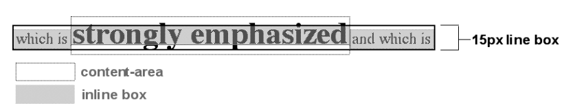
</div>
<p align="center">图 7-38：Inline boxes within a line</p>

<div style="margin: 0 auto; width: 70%;">
  
</div>
<p align="center">图 7-39：Line boxes within a paragraph</p>

As we can see in Figure 7-39, the middle line is taller than the other two, but it still isn’t big enough to contain all of the text within it. The anonymous text’s inline box determines the bottom of the line box, while the top of the strong element’s inline box sets the top of the line box. Because that inline box’s top is inside the element’s content area, the contents of the element spill outside the line box and actually overlap other line boxes. The result is that the lines of text look irregular.

正如我们在图 7-39 中看到的，中间的一行比其他两行要高，但是仍然不够大，不能容纳其中的所有文本。匿名文本的内联框确定行框的底部，而强元素的内联框的顶部设置行框的顶部。由于行内框的顶部位于元素的内容区域内，因此元素的内容溢出到行框之外，并与其他行框重叠。结果是文本的线条看起来不规则。

In just a bit, we’ll explore ways to cope with this behavior and methods for achieving consistent baseline spacing.

稍后，我们将探讨处理这种行为的方法，以及实现一致基线间距的方法。

### 7.3.6 Vertical Alignment

If we change the vertical alignment of the inline boxes, the same height determination principles apply. Suppose that we give the `strong` element a vertical alignment of `4px`:

如果我们更改内联框的垂直对齐方式，则应用相同的高度确定原则。假设我们给“强”元素一个垂直对齐的“4px”:

```html
<p style="font-size: 12px; line-height: 12px;">
  This is text, <em>some of which is emphasized</em>, plus other text<br />
  which is <strong style="font-size: 24px; vertical-align: 4px;">strongly emphasized</strong> and that is<br />
  larger than the surrounding text.
</p>
```

That small change raises the `strong` element four pixels, which pushes up both its content area and its inline box. Because the `strong` element’s inline box top was already the highest in the line, this change in vertical alignment also pushes the top of the line box upward by four pixels, as shown in Figure 7-40.

这个小的改变提高了“强”元素的 4 个像素，从而推高了它的内容区域和内联框。因为“strong”元素的内联框顶部已经是行中最高的了，这种垂直对齐的变化也会将行框顶部向上推 4 个像素，如图 7-40 所示。

<div style="margin: 0 auto; width: 70%;">
  
</div>
<p align="center">图 7-40：Vertical alignment affects line box height</p>

Let’s consider another situation. Here, we have another inline element in the same line as the strong text, and its alignment is other than the baseline:

让我们考虑另一种情况。这里，我们在强文本的同一行中有另一个内联元素，它的对齐方式不同于基线:

```html
<p style="font-size: 12px; line-height: 12px;">
  This is text, <em>some of which is emphasized</em>,<br />
  plus other text that is <strong style="font-size: 24px;">strong</strong> and
  <span style="vertical-align: top;">tall</span> and is<br />
  larger than the surrounding text.
</p>
```

Now we have the same result as in our earlier example, where the middle line box is taller than the other line boxes. However, notice how the “tall” text is aligned in Figure 7-41.

现在我们得到了与前面示例相同的结果，其中中间的行框比其他行框高。但是，请注意图 7-41 中的“高”文本是如何对齐的。

<div style="margin: 0 auto; width: 70%;">
  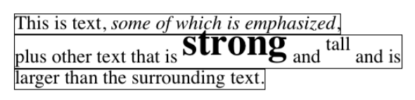
</div>
<p align="center">图 7-41：Aligning an inline element to the line box</p>

In this case, the top of the “tall” text’s inline box is aligned with the top of the line box. Since the “tall” text has equal values for `font-size` and `line-height`, the content height and inline box are the same. However, consider this:

在本例中，“高”文本的内联框的顶部与行框的顶部对齐。由于“高”文本对于“字体大小”和“行高”具有相同的值，所以内容高度和内联框是相同的。然而,考虑一下:

```html
<p style="font-size: 12px; line-height: 12px;">
  This is text, <em>some of which is emphasized</em>,<br />
  plus other text that is <strong style="font-size: 24px;">strong</strong> and
  <span style="vertical-align: top; line-height: 2px;">tall</span> and is<br />
  larger than the surrounding text.
</p>
```

Since the `line-height` for the “tall” text is less than its `font-size`, the inline box for that element is smaller than its content area. This tiny fact changes the placement of the text itself since the top of its inline box must be aligned with the top of the line box for its line. Thus, we get the result shown in Figure 7-42.

由于“高”文本的“行高”小于其“字体大小”，因此该元素的内联框小于其内容区域。这个微小的事实改变了文本本身的位置，因为它的行内框的顶部必须与该行的行框的顶部对齐。因此，我们得到如图 7-42 所示的结果。

On the other hand, we could set the “tall” text to have a `line-height` that is actually bigger than its `font-size`. For example:

另一方面，我们可以设置“高”文本的“行高”实际上大于它的“字体大小”。例如:

```html
<p style="font-size: 12px; line-height: 12px;">
  This is text, <em>some of which is emphasized</em>, plus other text<br />
  that is <strong style="font-size: 24px;">strong</strong> and
  <span style="vertical-align: top; line-height: 18px;">tall</span> and that is<br />
  larger than the surrounding text.
</p>
```

<div style="margin: 0 auto; width: 70%;">
  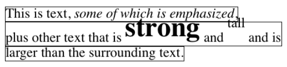
</div>
<p align="center">图 7-42：Text protruding from the line box (again)</p>

Since we’ve given the “tall” text a `line-height` of `18px`, the difference between `line-height` and `font-size` is six pixels. The half-leading of three pixels is added to the content area and results in an inline box that is 18 pixels tall. The top of this inline box aligns with the top of the line box. Similarly, the `vertical-align` value `bottom` will align the bottom of an inline element’s inline box with the bottom of the line box.

因为我们给了“高”文本一个“行高”的“18px”，“行高”和“字体大小”的区别是 6 像素。三个像素的半导被添加到内容区域，并产生一个 18 像素高的内联框。此内联框的顶部与行框的顶部对齐。类似地，“垂直对齐”值“底部”将使行内元素的行内框的底部与行框的底部对齐。

In relation to the terms we’ve been using in this chapter, the effects of the assorted keyword values of `vertical-align` are:

关于我们在本章中使用的术语，“垂直对齐”的关键字值组合的效果是:

`top`

Aligns the top of the element’s inline box with the top of the containing line box

将元素的内联框顶部与包含它的行框顶部对齐

`bottom`

Aligns the bottom of the element’s inline box with the bottom of the containing line box

将元素的内联框的底部与包含它的行框的底部对齐

`text-top`

Aligns the top of the element’s inline box with the top of the parent’s content area

将元素的内联框顶部与父元素的内容区域顶部对齐

`text-bottom`

Aligns the bottom of the element’s inline box with the bottom of the parent’s content area

将元素的内联框的底部与父内容区域的底部对齐

`middle`

Aligns the vertical midpoint of the element’s inline box with `0.5ex` above the baseline of the parent

将元素行内框的垂直中点与父元素基线上方的' 0.5ex '对齐

`super`

Moves the content area and inline box of the element upward. The distance is not specified and may vary by user agent

将元素的内容区域和内联框向上移动。这个距离没有指定，可能会随用户代理的不同而不同

`sub`

The same as super, except the element is moved downward instead of upward

与 super 相同，只是元素向下移动而不是向上移动

`<percentage>`

Shifts the element up or down the distance defined by taking the declared percentage of the element’s value for `line-height`

将元素向上或向下移动一个距离，这个距离是通过获取元素的“行高”值的声明百分比来定义的

### 7.3.7 Managing the line-height

In previous sections, we saw that changing the `line-height` of an inline element can cause text from one line to overlap another. In each case, though, the changes were made to individual elements. So how can we affect the `line-height` of elements in a more general way in order to keep content from overlapping?

在前面的小节中，我们看到改变内联元素的“行高”会导致文本从一行重叠到另一行。但是，在每种情况下，都对单个元素进行了更改。那么，我们如何以更一般的方式来影响元素的“行高”以避免内容重叠呢?

One way to do this is to use the `em` unit in conjunction with an element whose `font-size` has changed. For example:

一种方法是将' em '单元与' font-size '已更改的元素一起使用。例如:

```css
p {
  line-height: 1em;
}
big {
  font-size: 250%;
  line-height: 1em;
}
```

```html
<p>
  Not only does this paragraph have "normal" text, but it also<br />
  contains a line in which <big>some big text</big> is found.<br />
  This large text helps illustrate our point.
</p>
```

By setting a `line-height` for the `big` element, we increase the overall height of the line box, providing enough room to display the big element without overlapping any other text and without changing the `line-height` of all lines in the paragraph. We use a value of `1em` so that the `line-height` for the `big` element will be set to the same size as `big`’s font-size. Remember, `line-height` is set in relation to the `font-size` of the element itself, not the parent element. The results are shown in Figure 7-43.

通过为“大”元素设置“行高”，我们增加了行框的整体高度，提供足够的空间来显示大元素，而不重叠任何其他文本，也不改变段落中所有行的“行高”。我们使用' 1em '的值，以便' big '元素的' line-height '将被设置为与' big '的 font-size 相同的大小。请记住，' line-height '是根据元素本身的' font-size '设置的，而不是根据父元素设置的。结果如图 7-43 所示。

<div style="margin: 0 auto; width: 70%;">
  
</div>
<p align="center">图 7-43：Assigning the line-height property to inline elements</p>

Make sure you really understand the previous sections, because things will get trickier when we try to add borders. Let’s say we want to put five-pixel borders around any hyperlink:

请务必真正理解前面的部分，因为当我们尝试添加边框时，事情会变得更棘手。假设我们想在任何超链接周围放置 5 像素的边框:

```css
a:link {
  border: 5px solid blue;
}
```

If we don’t set a large enough `line-height` to accommodate the border, it will be in danger of overwriting other lines. We could increase the size of the inline box for unvisited links using `line-height`, as we did for the `big` element in the earlier example; in this case, we’d just need to make the value of `line-height` 10 pixels larger than the value of font-size for those links. However, that will be difficult if we don’t actually know the size of the font in pixels.

如果我们没有设置足够大的“行高”来容纳边界，它将有覆盖其他行的危险。我们可以使用' line-height '来增加未访问链接的内联框的大小，就像我们在前面的例子中对' big '元素所做的那样;在这种情况下，我们只需要让“行高”的值比那些链接的字体大小的值大 10 个像素。但是，如果我们不知道字体的大小(以像素为单位)，就很难做到这一点。

Another solution is to increase the `line-height` of the paragraph. This will affect every line in the entire element, not just the line in which the bordered hyperlink appears:

另一个解决方案是增加段落的“行高”。这将影响整个元素中的每一行，而不仅仅是带边框的超链接出现的那一行:

```css
p {
  line-height: 1.8em;
}
a:link {
  border: 5px solid blue;
}
```

Because there is extra space added above and below each line, the border around the hyperlink doesn’t impinge on any other line, as we can see in Figure 7-44.

因为在每行上下都添加了额外的空间，所以超链接周围的边界不会影响任何其他行，如图 7-44 所示。

This approach works here because all of the text is the same size. If there were other elements in the line that changed the height of the line box, our border situation might also change. Consider the following:

这种方法在这里是可行的，因为所有的文本大小都是相同的。如果线条中的其他元素改变了线条框的高度，那么我们的边界情况也可能改变。考虑以下:

```css
p {
  font-size: 14px;
  line-height: 24px;
}
a:link {
  border: 5px solid blue;
}
big {
  font-size: 150%;
  line-height: 1.5em;
}
```

Given these rules, the height of the inline box of a `big` element within a paragraph will be 31.5 pixels (14 × 1.5 × 1.5), and that will also be the height of the line box. In order to keep baseline spacing consistent, we must make the `p` element’s `line-height` equal to or greater than 32px.

根据这些规则，一个“大”元素在一个段落中的内联框的高度将是 31.5 像素(14×1.5×1.5)，这也将是行框的高度。为了保持基线间距一致，我们必须使“p”元素的“行高”等于或大于 32px。

<div style="margin: 0 auto; width: 70%;">
  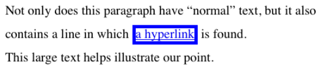
</div>
<p align="center">图 7-44：Increasing line-height to leave room for inline borders</p>

#### Baselines and line heights

The actual height of each line box depends on the way its component elements line up with one another. This alignment tends to depend very much on where the baseline falls within each element (or piece of anonymous text) because that location determines how the inline boxes are arranged. The placement of the baseline within each em box is different for every font. This information is built into the font files and cannot be altered by any means other than directly editing the font files.

每个线框的实际高度取决于其组件元素彼此对齐的方式。这种对齐在很大程度上依赖于基线在每个元素(或匿名文本)中的位置，因为该位置决定了内联框的排列方式。每个 em 框中的基线位置对于每种字体都是不同的。这些信息构建在字体文件中，除了直接编辑字体文件外，不能通过任何方式进行更改。

Consistent baseline spacing tends to be more of an art than a science. If you declare all of your font sizes and line heights using a single unit, such as ems, then you have a reliable chance of consistent baseline spacing. If you mix units, however, that feat becomes a great deal more difficult, if not impossible. As of this writing, there are proposals for properties that would let authors enforce consistent baseline spacing regardless of the inline content, which would greatly simplify certain aspects of online typography. None of these proposed properties have been implemented though, which makes their adoption a distant hope at best.

一致的基线间距更像是一门艺术而不是科学。如果您使用单一单元(如 ems)声明所有的字体大小和行高，那么您就有可靠的机会获得一致的基线间距。然而，如果你混合单位，这一壮举将变得更加困难，如果不是不可能的话。在撰写本文时，有一些关于属性的建议，可以让作者在不考虑行内内容的情况下强制执行一致的基线间距，这将极大地简化在线排版的某些方面。然而，这些提议的属性都没有实现，因此采用它们充其量只能是一个遥远的希望。

### 7.3.8 Scaling Line Heights

The best way to set `line-height`, as it turns out, is to use a raw number as the value. This method is the best because the number becomes the scaling factor, and that factor is an inherited, not a computed, value. Let’s say we want the `line-height`'s of all elements in a document to be one and a half times their `font-size`. We would declare:

事实证明，设置“行高”的最佳方法是使用原始数字作为值。这个方法是最好的，因为数字变成了比例因子，而这个因子是继承的，而不是计算的值。假设我们希望文档中所有元素的“行高”是它们的“字体大小”的 1.5 倍。我们将宣布:

```css
body {
  line-height: 1.5;
}
```

This scaling factor of 1.5 is passed down from element to element, and, at each level, the factor is used as a multiplier of the `font-size` of each element. Therefore, the following markup would be displayed as shown in Figure 7-45:

这个 1.5 的比例因子从一个元素传递到另一个元素，在每一层，这个因子用作每个元素的“字体大小”的乘数。因此，如下图 7-45 所示:

```css
p {
  font-size: 15px;
  line-height: 1.5;
}
small {
  font-size: 66%;
}
big {
  font-size: 200%;
}
```

```html
<p>
  This paragraph has a line-height of 1.5 times its font-size. In addition, any elements within it
  <small>such as this small element</small> also have line-heights 1.5 times their font-size...and that includes
  <big>this big element right here</big>. By using a scaling factor, line-heights scale to match the font-size of any
  element.
</p>
```

In this example, the line height for the `small` element turns out to be 15 pixels, and for the big element, it’s 45 pixels. (These numbers may seem excessive, but they’re in keeping with the overall page design.) Of course, if we don’t want our big text to generate too much extra leading, we can give it a `line-height` value, which will override the inherited scaling factor:

在本例中，“小”元素的行高为 15 像素，而大元素的行高为 45 像素。(这些数字可能看起来有些夸张，但它们与整个页面设计是一致的。)当然，如果我们不想让大的文本产生太多额外的前导，我们可以给它一个' line-height '的值，它会覆盖继承的比例因子:

```css
p {
  font-size: 15px;
  line-height: 1.5;
}
small {
  font-size: 66%;
}
big {
  font-size: 200%;
  line-height: 1em;
}
```

<div style="margin: 0 auto; width: 70%;">
  
</div>
<p align="center">图 7-45：Using a scaling factor for line-height</p>

Another solution—possibly the simplest of all—is to set the styles such that lines are no taller than absolutely necessary to hold their content. This is where we might use a `line-height` of `1.0`. This value will multiply itself by every `font-size` to get the same value as the `font-size` of every element. Thus, for every element, the inline box will be the same as the content area, which will mean the absolute minimum size necessary is used to contain the content area of each element.

另一种解决方案—可能是最简单的—是设置样式，使线条不高于容纳内容的绝对必要高度。这里我们可以使用' line-height ' = ' 1.0 '。该值将自身乘以每个“font-size”以得到与每个元素的“font-size”相同的值。因此，对于每个元素，内联框将与内容区域相同，这意味着使用绝对最小大小来包含每个元素的内容区域。

Most fonts still display a little bit of space between the lines of character glyphs because characters are usually smaller than their em boxes. The exception is script (“cursive”) fonts, where character glyphs are usually `larger` than their em boxes.

大多数字体仍然会在字符符号行之间显示一些空间，因为字符通常比它们的 em 方框小。唯一的例外是脚本(“草书”)字体，其中的字形通常比它们的 em 方框“大”。

### 7.3.9 Adding Box Properties

As you’re aware from previous discussions, padding, margins, and borders may all be applied to inline nonreplaced elements. These aspects of the inline element do not influence the height of the line box at all. If you were to apply some borders to a `span` element without any margins or padding, you’d get results such as those shown in Figure 7-46.

正如您从前面的讨论中了解到的，填充、边距和边框都可以应用于内联的不可替换元素。内联元素的这些方面完全不影响行框的高度。如果您要对“span”元素应用一些没有任何边距或填充的边框，您将得到如图 7-46 所示的结果。

The border edge of inline elements is controlled by the `font-size`, not the `line-height`. In other words, if a `span` element has a `font-size` of `12px` and a `line-height` of `36px`, its content area is `12px` high, and the border will surround that content area.

内联元素的边框由“字体大小”控制，而不是“行高”。换句话说，如果一个' span '元素的' font-size '为' 12px '， ' line-height '为' 36px '，那么它的内容区域的高度为' 12px '，边框将围绕该内容区域。

Alternatively, we can assign padding to the inline element, which will push the borders away from the text itself:

或者，我们可以为内联元素分配内边距，这将使边框远离文本本身:

```css
span {
  padding: 4px;
}
```

Note that this padding does not alter the actual shape of the content height, and so it will not affect the height of the inline box for this element. Similarly, adding borders to an inline element will not affect the way line boxes are generated and laid out, as illustrated in Figure 7-47.

注意，这个填充不会改变内容高度的实际形状，因此它不会影响这个元素的内联框的高度。类似地，向内联元素添加边框不会影响行框的生成和布局方式，如图 7-47 所示。

<div style="margin: 0 auto; width: 70%;">
  
</div>
<p align="center">图 7-46：Inline borders and line-box layout</p>

<div style="margin: 0 auto; width: 70%;">
  
</div>
<p align="center">图 7-47：Padding and borders do not alter line-height</p>

As for margins, they do not, practically speaking, apply to the top and bottom of an inline nonreplaced element, as they don’t affect the height of the line box. The ends of the element are another story.

至于边距，实际上，它们不应用于内联的不可替换元素的顶部和底部，因为它们不影响行框的高度。元素的结尾是另一个故事。

Recall the idea that an inline element is basically laid out as a single line and then broken up into pieces. So, if we apply margins to an inline element, those margins will appear at its beginning and end: these are the left and right margins, respectively. Padding also appears at the edges. Thus, although padding and margins (and borders) do not affect line heights, they can still affect the layout of an element’s content by pushing text away from its ends. In fact, negative left and right margins can pull text closer to the inline element, or even cause overlap, as Figure 7-48 shows.

回想一下，内联元素基本上是作为单行布局的，然后被分解成多个部分。因此，如果我们将边距应用于一个内联元素，这些边距将出现在它的开头和结尾:这些分别是左边距和右边距。边距也会出现。因此，尽管填充和边距(以及边框)不会影响行高，但它们仍然会影响元素内容的布局，因为它们会将文本推离其末端。实际上，负的左右边距会使文本更靠近内联元素，甚至会导致重叠，如图 7-48 所示。

Think of an inline element as a strip of paper with some plastic surrounding it. Displaying the inline element on multiple lines is like slicing up the strip into smaller strips. However, no extra plastic is added to each smaller strip. The only plastic is that which was on the strip to begin with, so it appears only at the beginning and end of the original ends of the paper strip (the inline element). At least, that’s the default behavior, but as we’ll soon see, there is another option.

可以把内联元素想象成一条纸，纸的周围有一些塑料。在多行上显示内联元素就像将条带分割成更小的条带。然而，没有额外的塑料添加到每个小条。唯一的塑料是一开始就在纸带上的，所以它只出现在纸带的原始末端的开始和末端(内联元素)。至少，这是默认的行为，但是我们很快就会看到，还有另一种选择。

<div style="margin: 0 auto; width: 70%;">
  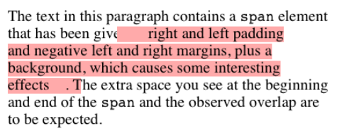
</div>
<p align="center">图 7-48：Padding and margins on the ends of an inline element</p>

So, what happens when an inline element has a background and enough padding to cause the lines’ backgrounds to overlap? Take the following situation as an example:

那么，当一个内联元素有一个背景和足够的内边距来导致线条的背景重叠时会发生什么呢?以以下情况为例:

```css
p {
  font-size: 15px;
  line-height: 1em;
}
p span {
  background: #faa;
  padding-top: 10px;
  padding-bottom: 10px;
}
```

All of the text within the `span` element will have a content area 15 pixels tall, and we’ve applied 10 pixels of padding to the top and bottom of each content area. The extra pixels won’t increase the height of the line box, which would be fine, except there is a background color. Thus, we get the result shown in Figure 7-49.

“span”元素中的所有文本都有一个 15 像素高的内容区域，我们在每个内容区域的顶部和底部都应用了 10 个像素的填充。额外的像素不会增加线框的高度，这是可以的，除了有一个背景颜色。因此，我们得到如图 7-49 所示的结果。

CSS 2.1 explicitly states that the line boxes are drawn in document order: “This will cause the borders on subsequent lines to paint over the borders and text of previous lines.” The same principle applies to backgrounds as well, as Figure 7-49 shows. CSS2, on the other hand, allowed user agents “to ‘clip’ the border and padding areas (i.e., not render them).” Therefore, the results may depend greatly on which specification the user agent follows.

CSS 2.1 明确规定了线条框是按文档顺序绘制的:“这将导致后续行上的边框被绘制到前一行的边框和文本上。同样的原理也适用于背景，如图 7-49 所示。另一方面，CSS2 允许用户代理“裁剪”边界和填充区域(即，用户代理可以对边界和填充区域进行“裁剪”)。，而不是渲染它们)。因此，结果可能在很大程度上取决于用户代理遵循的规范。

<div style="margin: 0 auto; width: 70%;">
  
</div>
<p align="center">图 7-49：Overlapping inline backgrounds</p>

### 7.3.10 Changing Breaking Behavior

In the previous section, we saw that when an inline nonreplaced element is broken across multiple lines, it’s treated as if it were one long single-line element that’s sliced into smaller boxes, one slice per line break. That’s actually just the default behavior, and it can be changed via the property `box-decoration-break`.

在前一节中，我们看到当一个内联的不可替换元素跨多行分解时，它被视为一个长单行元素，被分割成更小的框，每个行分解一个块。这实际上只是默认行为，它可以通过属性“box- decorator -break”进行更改。

//

The default value, `slice`, is what we saw in the previous section. The other value, `clone`, causes each fragement of the element to be drawn as if it were a standalone box. What does that mean? Compare the two examples in Figure 7-50, in which exactly the same markup and styles are treated as either sliced or cloned.

默认值“slice”是我们在前一节中看到的。另一个值“clone”使元素的每个片段都像一个独立的盒子一样被绘制。这是什么意思?比较图 7-50 中的两个示例，其中将完全相同的标记和样式视为切片或克隆。

Many of the differences are pretty apparent, but a few are perhaps more subtle. Among the effects are the application of padding to each element’s fragment, including at the ends where the line breaks occurred. Similarly, the border is drawn around each fragment individually, instead of being broken up.

许多差异是非常明显的，但有一些可能更微妙。这些效果包括对每个元素片段的填充，包括换行的末端。类似地，边界被单独地画在每个片段周围，而不是被分割。

<div style="margin: 0 auto; width: 70%;">
  
</div>
<p align="center">图 7-50：Sliced and cloned inline fragments</p>

More subtly, notice how the `background-image` positioning changes between the two. In the sliced version, background images are sliced along with everything else, meaning that only one of the fragments contains the origin image. In the cloned version, however, each background acts as its own copy, so each has its own origin image. This means, for example, that even if we have a nonrepeated background image, it will appear once in each fragment instead of only in one fragment.

更微妙的是，请注意“background-image”的位置是如何在两者之间变化的。在切片版本中，背景图像与其他所有内容一起被切片，这意味着只有一个片段包含原始图像。但是，在克隆版本中，每个背景都充当自己的副本，因此每个背景都有自己的原始图像。这意味着，例如，即使我们有一个非重复的背景图像，它也会在每个片段中出现一次，而不是只在一个片段中出现。

The `box-decoration-break` property will most often be used with inline boxes, but itactually applies in any situation where there’s a break in an element—for example, when a page break interrupts an element in paged media. In such a case, each fragment is a separate slice. If we set `box-decoration-break: clone`, then each box fragment will be treated as a copy when it comes to borders, padding, backgrounds, and so on. The same holds true in multicolumn layout: if an element is split by a column break, the value of `box-decoration-break` will affect how it is rendered.

“box-decoration-break”属性最常与内联框一起使用，但它实际上适用于元素发生中断的任何情况——例如，当分页符中断了分页媒体中的某个元素时。在这种情况下，每个片段都是一个单独的片。如果我们设置“box-decoration-break: clone”，那么当涉及到边框、填充、背景等时，每个 box 片段都将被视为一个副本。在多列布局中也是如此:如果一个元素被一个列分隔开，“box-decoration-break”的值将影响它的呈现方式。

### 7.3.11 Glyphs Versus Content Area

Even in cases where you try to keep inline nonreplaced element backgrounds from overlapping, it can still happen, depending on which font is in use. The problem lies in the difference between a font’s em box and its character glyphs. Most fonts, as it turns out, don’t have em boxes whose heights match the character glyphs.

即使在您试图保持内联非替换元素背景不重叠的情况下，也可能发生重叠，这取决于使用的是哪种字体。问题在于字体的 em 框和它的字符符号之间的区别。事实证明，大多数字体都没有与字形高度匹配的 em 方框。

That may sound very abstract, but it has practical consequences. In CSS2.1, we find the following: “the height of the content area should be based on the font, but this specification does not specify how. A user agent may…use the em box or the maximum ascender and descender of the font. (The latter would ensure that glyphs with parts above or below the em box still fall within the content area, but leads to differently sized boxes for different fonts.)”

这听起来可能很抽象，但它有实际的后果。在 CSS2.1 中，我们发现了以下内容:“内容区域的高度应该基于字体，但是该规范没有指定如何设置。用户代理可以…使用 em 框或字体的最大上升和下降。(后者将确保 em 框上下部分的字形仍然在内容区域内，但会导致不同字体的不同大小的框。)

In other words, the “painting area” of an inline nonreplaced element is left to the user agent. If a user agent takes the em box to be the height of the content area, then the background of an inline nonreplaced element will be equal to the height of the em box (which is the value of `font-size`). If a user agent uses the maximum ascender and descender of the font, then the background may be taller or shorter than the em box. Therefore, you could give an inline nonreplaced element a `line-height` of `1em` and still have its background overlap the content of other lines.

换句话说，内联不可替换元素的“绘制区域”留给用户代理。如果用户代理将 em 框作为内容区域的高度，那么内联不可替换元素的背景将等于 em 框的高度(即“font-size”的值)。如果用户代理使用字体的最大上升和下降，那么背景可能比 em 框更高或更短。因此，您可以给一个内联的不可替换元素一个' line-height ' of ' 1em '，而它的背景仍然与其他行的内容重叠。

### 7.3.12 Inline Replaced Elements

Inline replaced elements, such as images, are assumed to have an intrinsic height and width; for example, an image will be a certain number of pixels high and wide. Therefore, a replaced element with an intrinsic height can cause a line box to become taller than normal. This does `not` change the value of `line-height` for any element in the line, including the replaced element itself. Instead, the line box is made just tall enough to accommodate the replaced element, plus any box properties. In other words, the entirety of the replaced element—content, margins, borders, and padding—is used to define the element’s inline box. The following styles lead to one such example, as shown in Figure 7-51:

内联替换的元素，如图像，假定具有固有的高度和宽度;例如，一个图像将是一定数量的像素高和宽。因此，一个被替换的具有固有高度的元素会导致一个线框比正常情况下要高。这不会改变行中任何元素的“行高”值，包括被替换的元素本身。相反，行框的高度刚好能够容纳替换的元素和任何框属性。换句话说，整个被替换的元素——内容、边距、边框和标记——都用来定义元素的内联框。下面的样式就是一个这样的例子，如图 7-51 所示:

```css
p {
  font-size: 15px;
  line-height: 18px;
}
img {
  height: 30px;
  margin: 0;
  padding: 0;
  border: none;
}
```

Despite all the blank space, the effective value of `line-height` has not changed, either for the paragraph or the image itself. `line-height` has no effect on the image’s inline box. Because the image in Figure 7-51 has no padding, margins, or borders, its inline box is equivalent to its content area, which is, in this case, 30 pixels tall.

尽管所有的空白，“行高”的有效值并没有改变，无论是对于段落还是图像本身。' line-height '对图像的内联框没有影响。因为图 7-51 中的图像没有填充、空白或边框，所以它的内联框相当于它的内容区域，在本例中是 30 像素高。

Nonetheless, an inline replaced element still has a value for `line-height`. Why? In the most common case, it needs the value in order to correctly position the element if it’s been vertically aligned. Recall that, for example, percentage values for verticalalign are calculated with respect to an element’s `line-height`. Thus:

尽管如此，内联替换的元素仍然有一个“行高”的值。为什么?在最常见的情况下，如果元素是垂直对齐的，则需要该值来正确定位元素。例如，垂直对齐的百分比值是根据元素的“行高”计算的。因此:

```css
p {
  font-size: 15px;
  line-height: 18px;
}
img {
  vertical-align: 50%;
}
```

```html
<p>the image in this sentence  will be raised 9 pixels.</p>
```

<div style="margin: 0 auto; width: 70%;">
  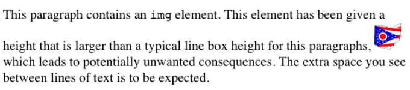
</div>
<p align="center">图 7-51：Replaced elements can increase the height of the line box but not the value of line-height</p>

The inherited value of `line-height` causes the image to be raised nine pixels instead of some other number. Without a value for `line-height`, it wouldn’t be possible to perform percentage-value vertical alignments. The height of the image itself has no relevance when it comes to vertical alignment; the value of `line-height` is all that matters.

继承的' line-height '值会使图像提升 9 个像素，而不是其他数字。如果没有“行高度”的值，就不可能执行百分比值垂直对齐。图像本身的高度与垂直对齐无关;“行高”的值才是最重要的。

However, for other replaced elements, it might be important to pass on a `line-height` value to descendant elements within that replaced element. An example would be an SVG image, which uses CSS to style any text found within the image.

但是，对于其他被替换的元素，将“行高”值传递给被替换元素中的后代元素可能很重要。一个例子是 SVG 图像，它使用 CSS 对图像中的任何文本进行样式设置。

### 7.3.13 Adding Box Properties

After everything we’ve just been through, applying margins, borders, and padding to inline replaced elements almost seems simple.

在我们经历了所有这些之后，将边距、边框和填充应用到内联替换的元素中似乎很简单。

Padding and borders are applied to replaced elements as usual; padding inserts space around the actual content and the border surrounds the padding. What’s unusual about the process is that these two things actually influence the height of the line box because they are part of the inline box of an inline replaced element (unlike inline nonreplaced elements). Consider Figure 7-52, which results from the following styles:

像往常一样，对替换后的元素应用填充和边框;padding 在实际内容周围插入空格，边框包围 padding。这个过程的不同寻常之处在于，这两个东西实际上影响了行框的高度，因为它们是内联替换元素的内联框的一部分(与内联非替换元素不同)。考虑图 7-52，它由以下风格产生:

```css
img {
  height: 50px;
  width: 50px;
}
img.one {
  margin: 0;
  padding: 0;
  border: 3px dotted;
}
img.two {
  margin: 10px;
  padding: 10px;
  border: 3px solid;
}
```

Note that the first line box is made tall enough to contain the image, whereas the second is tall enough to contain the image, its padding, and its border.

注意，第一行框的高度足以包含图像，而第二行框的高度足以包含图像、填充和边框。

<div style="margin: 0 auto; width: 70%;">
  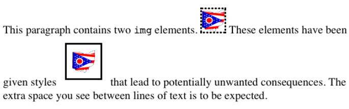
</div>
<p align="center">图 7-52：Adding padding, borders, and margins to an inline replaced element increases its inline box</p>

Margins are also contained within the line box, but they have their own wrinkles. Setting a positive margin is no mystery; it will make the inline box of the replaced element taller. Setting negative margins, meanwhile, has a similar effect: it decreases the size of the replaced element’s inline box. This is illustrated in Figure 7-53, where we can see that a negative top margin is pulling down the line above the image:

边距也包含在行框中，但是它们有自己的皱纹。设置一个积极的保证金并不神秘;它将使被替换元素的内联框更高。同时，设置负边距也有类似的效果:它减少了被替换元素的内联框的大小。如图 7-53 所示，在图 7-53 中，我们可以看到一个负的顶边正在向下拉图像上方的线:

```css
img.two {
  margin-top: -10px;
}
```

Negative margins operate the same way on block-level elements, of course. In this case, the negative margins make the replaced element’s inline box smaller than ordinary. Negative margins are the only way to cause inline replaced elements to bleed into other lines, and it’s why the boxes that replaced inline elements generate are often assumed to be inline-block.

当然，负边距对块级元素的操作方式是相同的。在本例中，负边距使被替换的元素的内联框比普通的小。负边距是导致内联替换元素渗入其他行中的唯一方法，这就是为什么替换内联元素生成的框通常被认为是内联块的原因。

<div style="margin: 0 auto; width: 70%;">
  
</div>
<p align="center">图 7-53：The effect of negative margins on inline replaced elements</p>

### 7.3.14 Replaced Elements and the Baseline

You may have noticed by now that, by default, inline replaced elements sit on the baseline. If you add bottom padding, a margin, or a border to the replaced element, then the content area will move upward (assuming `box-sizing: content-box`). Replaced elements do not have baselines of their own, so the next best thing is to align the bottom of their inline boxes with the baseline. Thus, it is actually the bottom outer margin edge that is aligned with the baseline, as illustrated in Figure 7-54.

您可能已经注意到，默认情况下，内联替换的元素位于基线上。如果向替换的元素添加底部填充、空白或边框，则内容区域将向上移动(假设为“box-sizing: content-box”)。被替换的元素没有自己的基线，所以下一个最好的方法是将它们的内联框底部与基线对齐。因此，它实际上是与基线对齐的底部外边缘边缘，如图 7-54 所示。

<div style="margin: 0 auto; width: 70%;">
  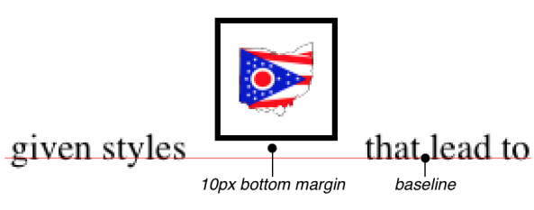
</div>
<p align="center">图 7-54：Inline replaced elements sit on the baseline</p>

This baseline alignment leads to an unexpected (and unwelcome) consequence: an image placed in a table cell all by itself should make the table cell tall enough to contain the line box containing the image. The resizing occurs even if there is no actual text, not even whitespace, in the table cell with the image. Therefore, the common sliced-image and spacer-GIF designs of years past can fall apart quite dramatically in modern browsers. (I know that you don’t create such things, but this is still a handy context in which to explain this behavior.) Consider the simplest case:

这种基线对齐会导致一个意想不到的(并且不受欢迎的)结果:单独放置在表格单元中的图像应该使表格单元足够高，以包含包含图像的行框。即使图像所在的表格单元格中没有实际的文本，甚至没有空白，也会发生调整大小的操作。因此，在现代浏览器中，过去常见的切片图像和间隔 gif 设计可能会急剧崩溃。(我知道您不会创建这样的东西，但这仍然是解释这种行为的方便上下文。)考虑最简单的情况:

```css
td {
  font-size: 12px;
}
```

```html
<td></td>
```

Under the CSS inline formatting model, the table cell will be 12 pixels tall, with the image sitting on the baseline of the cell. So there might be three pixels of space below the image and eight above it, although the exact distances would depend on the font family used and the placement of its baseline.

在 CSS 内联格式模型下，表格单元格将有 12 个像素高，图像位于单元格的基线上。因此，图像下方可能有 3 个像素，上方可能有 8 个像素，尽管确切的距离取决于使用的字体种类及其基线的位置。

This behavior is not confined to images inside table cells; it will also happen in any situation where an inline replaced element is the sole descendant of a block-level or table-cell element. For example, an image inside a `div` will also sit on the baseline.

这种行为并不局限于表格单元格中的图像;当内联替换的元素是块级或表单元元素的唯一后代元素时，也会发生这种情况。例如，“div”中的图像也会位于基线上。

The most common workaround for such circumstances is to make images in table cells block-level so that they do not generate a line box. For example:

对于这种情况，最常见的解决方案是在表格单元格块级别上生成图像，这样它们就不会生成行框。例如:

```css
td {
  font-size: 12px;
}
img.block {
  display: block;
}
```

```html
<td></td>
```

Another possible fix would be to make the `font-size` and `line-height` of the enclosing table cell `1px`, which would make the line box only as tall as the one-pixel image within it.

另一种可能的解决方案是将包围的表格单元格的“font-size”和“line-height”设置为“1px”，这将使行框仅与其中的一个像素图像一样高。

As of this writing, many browsers can ignore this CSS inline formatting model in this context. See the article `“Images, Tables, and Mysterious Gaps”` for more information.

在撰写本文时，许多浏览器可以在这个上下文中忽略这个 CSS 内联格式模型。有关更多信息，请参见文章“图像、表格和神秘的空白”。

Here’s another interesting effect of inline replaced elements sitting on the baseline: if we apply a negative bottom margin, the element will actually get pulled downward because the bottom of its inline box will be higher than the bottom of its content area. Thus, the following rule would have the result shown in Figure 7-55:

这里是位于基线上的内联替换元素的另一个有趣的效果:如果我们应用一个负的底部空白，元素实际上会被向下拉，因为它的内联框的底部将高于它的内容区域的底部。因此，下面的规则将得到如图 7-55 所示的结果:

```css
p img {
  margin-bottom: -10px;
}
```

<div style="margin: 0 auto; width: 70%;">
  
</div>
<p align="center">图 7-55：Pulling inline replaced elements down with a negative bottom margin</p>

This can easily cause a replaced element to bleed into following lines of text, as Figure 7-55 shows.

这很容易导致替换的元素渗入到以下几行文本中，如图 7-55 所示。

#### Inline with History

The CSS inline formatting model may seem needlessly complex and, in some ways, even contrary to author expectations. Unfortunately, the complexity is the result of creating a style language that is both backward-compatible with pre-CSS web browsers and leaves the door open for future expansion into more sophisticated territory—an awkward blend of past and present. It’s also the result of making some sensible decisions that avoid one undesirable effect while causing another.

CSS 内联格式模型可能看起来不必要的复杂，在某些方面甚至与作者的期望相反。不幸的是，这种复杂性是创建一种样式语言的结果，这种语言既向后兼容 css 之前的 web 浏览器，又为将来扩展到更复杂的领域打开了大门——过去和现在的尴尬混合。它也是做出一些明智决定的结果，这些决定避免了一种不受欢迎的影响，同时导致了另一种影响。

For example, the “spreading apart” of lines of text by image and vertically aligned text owes its roots to the way Mosaic 1.0 behaved. In that browser, any image in a paragraph would push open enough space to contain the image. That’s a good behavior, since it prevents images from overlapping text in other lines. So when CSS introduced ways to style text and inline elements, its authors endeavored to create a model that did not (by default) cause inline images to overlap other lines of text. However, the same model also meant that a superscript element (`sup`), for example, would likely also push apart lines of text.

例如，通过图像“分散”文本行和垂直对齐的文本源于 Mosaic 1.0 的行为方式。在该浏览器中，段落中的任何图像都会打开足够的空间来容纳图像。这是一个很好的行为，因为它可以防止图像与其他行中的文本重叠。因此，当 CSS 引入样式文本和内联元素的方法时，其作者试图创建一个模型，该模型不会(默认情况下)导致内联图像与其他文本行重叠。然而，同样的模型也意味着上标元素(' sup ')可能也会将文本的行分开。

Such effects annoy some authors who want their baselines to be an exact distance apart and no further, but consider the alternative. If `line-height` forced baselines to be exactly a specified distance apart, we’d easily end up with inline replaced and vertically shifted elements that overlap other lines of text—which would also annoy authors. Fortunately, CSS offers enough power to create your desired effect in one way or another, and the future of CSS holds even more potential.

这样的影响惹恼了一些作者，他们希望基线之间有一个精确的距离，而且不能再远了，但是考虑另一种选择。如果“行高”要求基线之间的距离必须精确到指定的距离，那么我们很容易就会得到内联替换和垂直移动的元素，这些元素会覆盖文本的其他行，这也会惹恼作者。幸运的是，CSS 提供了足够的能力来以这样或那样的方式创建您想要的效果，而且 CSS 的未来具有更大的潜力。

### 7.3.15 Inline-Block Elements

As befits the hybrid look of the value name `inline-block`, inline-block elements are indeed a hybrid of block-level and inline elements. This display value was introduced in CSS2.1.

与值名称“内联块”的混合外观相匹配，内联块元素实际上是块级元素和内联元素的混合。这个显示值是在 CSS2.1 中引入的。

An inline-block element relates to other elements and content as an inline box. In other words, it’s laid out in a line of text just as an image would be, and in fact, inlineblock elements are formatted within a line as a replaced element. This means the bottom of the inline-block element will rest on the baseline of the text line by default and will not line break within itself.

内联块元素与作为内联框的其他元素和内容相关。换句话说，它在一行文本中布局，就像图像一样，而且实际上，inlineblock 元素在一行中被格式化为一个被替换的元素。这意味着默认情况下，内联块元素的底部将位于文本行的基线上，而不会在其内部换行。

Inside the inline-block element, the content is formatted as though the element were block-level. The properties `width` and `height` apply to it (and thus so does `box-sizing`), as they do to any block-level or inline replaced element, and those properties will increase the height of the line if they are taller than the surrounding content.

在内联块元素内部，内容被格式化为块级元素。属性“width”和“height”应用于它(因此，“box-sizing”也应用于它)，就像它们应用于任何块级或内联替换的元素一样，如果这些属性比周围的内容高，它们就会增加行高。

Let’s consider some example markup that will help make this clearer:

让我们考虑一些例子标记，将有助于使这一点更清楚:

```html
<div id="one">
  This text is the content of a block-level level element. Within this block-level element is another block-level
  element.
  <p>Look, it's a block-level paragraph.</p>
  Here's the rest of the DIV, which is still block-level.
</div>
<div id="two">
  This text is the content of a block-level level element. Within this block-level element is an inline element.
  <p>Look, it's an inline paragraph.</p>
  Here's the rest of the DIV, which is still block-level.
</div>
<div id="three">
  This text is the content of a block-level level element. Within this block-level element is an inline-block element.
  <p>Look, it's an inline-block paragraph.</p>
  Here's the rest of the DIV, which is still block-level.
</div>
```

To this markup, we apply the following rules:

对于这种标记，我们应用以下规则:

```css
div {
  margin: 1em 0;
  border: 1px solid;
}
p {
  border: 1px dotted;
}
div#one p {
  display: block;
  width: 6em;
  text-align: center;
}
div#two p {
  display: inline;
  width: 6em;
  text-align: center;
}
div#three p {
  display: inline-block;
  width: 6em;
  text-align: center;
}
```

The result of this stylesheet is depicted in Figure 7-56.

此样式表的结果如图 7-56 所示。

<div style="margin: 0 auto; width: 70%;">
  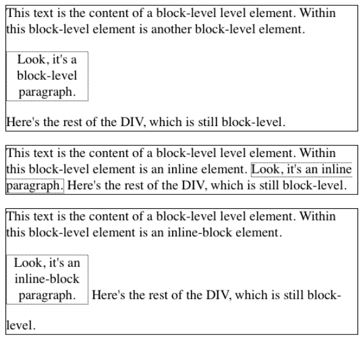
</div>
<p align="center">图 7-56：The behavior of an inline-block element</p>

Notice that in the second `div`, the inline paragraph is formatted as normal inline content, which means `width` and `text-align` get ignored (since they do not apply to inline elements). For the third `div`, however, the inline-block paragraph honors both properties, since it is formatted as a block-level element. That paragraph’s margins also force its line of text to be much taller, since it affects line height as though it were a replaced element.

请注意，在第二个“div”中，行内段落的格式与普通的行内内容相同，这意味着“宽度”和“文本对齐”将被忽略(因为它们不适用于行内元素)。但是，对于第三个“div”，内联块段落同时具有这两个属性，因为它的格式是块级元素。该段的页边距还迫使其文本行更高，因为它会影响行高，就好像它是一个被替换的元素。

If an inline-block element’s `width` is not defined or explicitly declared `auto`, the element box will shrink to fit the content. That is, the element box is exactly as wide as necessary to hold the content, and no wider. Inline boxes act the same way, although they can break across lines of text, whereas inline-block elements cannot. Thus, we have the following rule, when applied to the previous markup example:

如果内联块元素的“宽度”没有定义或没有显式地声明为“自动”，则元素框将缩小以适合内容。也就是说，元素框的宽度正好与容纳内容所需的宽度相同，而不是更宽。内联框的作用是相同的，尽管它们可以跨文本行，而内联块元素不能。因此，我们有以下规则，当应用到前面的标记示例时:

```css
div#three p {
  display: inline-block;
  height: 4em;
}
```

will create a tall box that’s just wide enough to enclose the content, as shown in Figure 7-57.

将创建一个高框，其宽度刚好可以容纳内容，如图 7-57 所示。

<div style="margin: 0 auto; width: 70%;">
  
</div>
<p align="center">图 7-57：Autosizing of an inline-block element</p>

Inline-block elements can be useful if, for example, we have a set of five hyperlinks that we want to be equal width within a toolbar. To make them all 20% the width of their parent element, but still leave them inline, declare:

例如，如果在工具栏中有 5 个希望宽度相等的超链接，那么内联块元素可能很有用。要使它们的宽度都是父元素宽度的 20%，但仍然保持内联，请声明:

```css
nav a {
  display: inline-block;
  width: 20%;
}
```

Flexible-box layout is another way to achieve this effect, and is probably better suited to it in most if not all cases.

灵活的盒子布局是实现这种效果的另一种方式，并且在大多数情况下(如果不是所有情况的话)可能更适合它。

### 7.3.16 Flow Display

The values `flow` and `flow-root` deserve a moment of explanation. Declaring an element to be laid out using display: flow means that it should use block-and-inline layout, the same as normal. That is, unless it’s combined with inline, in which case it generates an inline box.

值“flow”和“flow-root”值得解释一下。使用 display: flow 声明要布局的元素意味着它应该使用块和内联布局，与普通布局相同。也就是说，除非它与 inline 相结合，在这种情况下，它会生成一个内联框。

In other words, the first two of the following rules will result in a block box, whereas the third will yield an inline box.

换句话说，下面的前两个规则将产生一个块框，而第三个规则将产生一个内联框。

```css
#first {
  display: flow;
}
#second {
  display: block flow;
}
#third {
  display: inline flow;
}
```

The reason for this pattern is that CSS is moving to a system where there are two kinds of display: the `outer display type` and the `inner display typ`e. Value keywords like `block` and `inline` represent the outer display type, which provides how the display box interacts with its surroundings. The inner display, in this case `flow`, describes what should happen inside the element.

出现这种模式的原因是，CSS 正在转移到一个有两种显示类型的系统:“外部显示类型”和“内部显示类型”。像“块”和“内联”这样的值关键字表示外部显示类型，它提供了显示框与周围环境的交互方式。内部显示(在本例中为“flow”)描述了元素内部应该发生的事情。

This approach allows for declarations like display: inline table to indicate an element should generate a table formatting context within, but relate to its surrounding content as an inline element. (The legacy value `inline-table` has the same effect.)

这种方法允许使用 display: inline table 这样的声明来指示元素应该在其内部生成表格式化上下文，但是要将其周围的内容作为内联元素关联起来。(遗留值“内联表”具有相同的效果。)

`display: flow-root`, on the other hand, always generates a block box, with a new block formatting context inside itself. This is the sort of thing that would be applied to the root element of a document, like `html`, to say “this is where the formatting root lies.”

另一方面，“display: flow-root”总是会生成一个块框，其中包含一个新的块格式化上下文。这是一种应用到文档的根元素(如“html”)上的东西，表示“这是格式化根元素所在的位置”。

The old `display` values you may be familiar with are still available. Table 7-1 shows how the old values will be represented using the new values.

您可能熟悉的旧的“显示”值仍然可用。表 7-1 显示了如何使用新值表示旧值。

//

As of late 2017, `flow` and `flow-root` were supported by Firefox and Chrome, but no other browsers.

截至 2017 年底，Firefox 和 Chrome 支持“flow”和“flow-root”，但其他浏览器不支持。

### 7.3.17 Contents Display

There is one fascinating new addition to `display`, which is the value `contents`. When applied to an element, `display: contents` causes the element to be removed from page formatting, and effectively “elevates” its child elements to its level. As an example, consider the following simple CSS and HTML.

“显示”还有一个有趣的新功能，那就是“内容”的值。当应用于一个元素时，“display: contents”会将该元素从页面格式中移除，并有效地将其子元素“提升”到其级别。作为一个例子，考虑以下简单的 CSS 和 HTML。

```css
ul {
  border: 1px solid red;
}
li {
  border: 1px solid silver;
}
```

```html
<ul>
  <li>The first list item.</li>
  <li>List Item II: The Listening.</li>
  <li>List item the third.</li>
</ul>
```

That will yield an unordered list with a red border, and three list items with silver borders.

这将生成一个带有红色边框的无序列表，以及三个带有银色边框的列表项。

If we then apply `display: contents` to the `ul` element, the user agent will render things as if the `<ul>` and `</ul>` lines had been deleted from the document source. The difference in the regular result and the `contents` result is shown in Figure 7-58.

如果我们将“display: contents”应用到“ul”元素，那么用户代理将呈现`<ul>` and `</ul>`行已从文档源中删除。常规结果与“contents”结果的差异如图 7-58 所示。

<div style="margin: 0 auto; width: 70%;">
  
</div>
<p align="center">图 7-58：A regular unordered list, and one with display: contents</p>

The list items are still list items, and act like them, but visually, the `ul` is gone, as if had never been. The means not only does its border go away, but also the top and bottom margins that usually separate the list from surrounding content. This is why the second list in Figure 7-58 appears higher up than the first.

列表项仍然是列表项，它们的行为与列表项类似，但是在视觉上，“ul”已经消失，就好像从来没有消失过一样。这不仅意味着它的边框消失了，而且通常将列表与周围内容分隔开的顶部和底部空白也消失了。这就是为什么图 7-58 中的第二个列表比第一个列表高。

As of late 2017, only Firefox browsers supported `display: contents`. At the time, implementation work was being done for the Chrome/Blink line of browsers.

截至 2017 年底，只有火狐浏览器支持“显示:内容”。当时，Chrome/Blink 系列浏览器的实现工作正在进行。

### 7.3.18 Other Display Values

There are a great many more display values we haven’t covered in this chapter, and won’t. The various table-related values will come up in a later chapter devoted to table layout, and we’ll talk about list items again in the chapter on counters and generated content.

还有更多的显示值我们在本章中没有涉及，以后也不会涉及。各种与表相关的值将在后面专门讨论表布局的一章中出现，我们将在关于计数器和生成内容的一章中再次讨论列表项。

Values we won’t really talk about are the ruby-related values, which need their own book and are poorly supported as of late 2017; and `run-in`, which never caught on and will either be dropped from CSS, or will return with a new definition.

我们不会真正谈论的价值观是与红宝石相关的价值观，它们需要自己的书，而且截至 2017 年底，它们的支持度很低;还有“run-in”，它从未流行起来，要么从 CSS 中删除，要么返回一个新的定义。

### 7.3.19 Computed Values

The computed value of `display` can change if an element is floated or positioned. It can also change when declared for the root element. In fact, the values `display`, `position`, and `float` interact in interesting ways.

如果一个元素被浮动或定位，“display”的计算值可以改变。它也可以在为根元素声明时进行更改。实际上，值“display”、“position”和“float”以有趣的方式交互。

If an element is absolutely positioned, the value of `float` is set to `none`. For either floated or absolutely positioned elements, the computed value of `display` is determined by the declared value, as shown in Table 7-2.

如果一个元素是绝对定位的，' float '的值被设置为' none '。对于浮动元素或绝对定位元素，“display”的计算值由声明的值决定，如表 7-2 所示。

//

In the case of the root element, declaring either of the values `inline-table` or `table` results in a computed value of `table`, whereas declaring `none` results in the same computed value. All other display values are computed to be block.

对于根元素，声明值“inline-table”或“table”中的任何一个都将导致“table”的计算值，而声明“none”将导致相同的计算值。所有其他显示值都被计算为块。

## 7.4 Summary

Although some aspects of the CSS formatting model may seem counterintuitive at first, they begin to make sense the more one works with them. In many cases, rules that seem nonsensical or even idiotic turn out to exist in order to prevent bizarre or otherwise undesirable document displays. Block-level elements are in many ways easy to understand, and affecting their layout is typically a simple task. Inline elements, on the other hand, can be trickier to manage, as a number of factors come into play, not least of which is whether the element is replaced or nonreplaced.

虽然 CSS 格式化模型的某些方面乍一看似乎违反直觉，但随着使用的深入，它们开始变得有意义。在许多情况下，看起来荒谬甚至愚蠢的规则实际上是为了防止奇怪或不受欢迎的文档显示而存在的。块级元素在很多方面都很容易理解，影响它们的布局通常是一项简单的任务。另一方面，内联元素可能更难管理，因为有许多因素在起作用，尤其是元素是被替换还是没有被替换。
